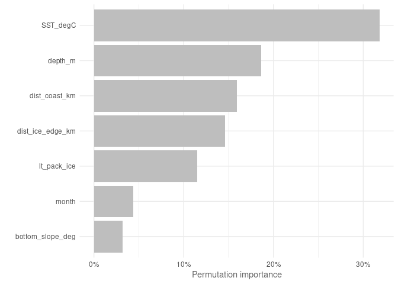
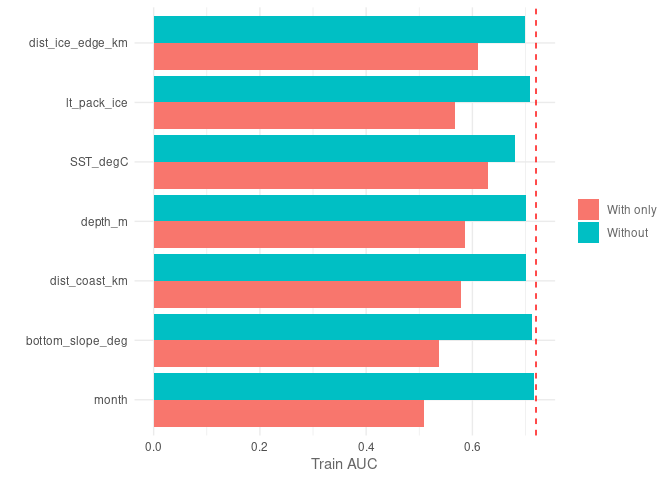
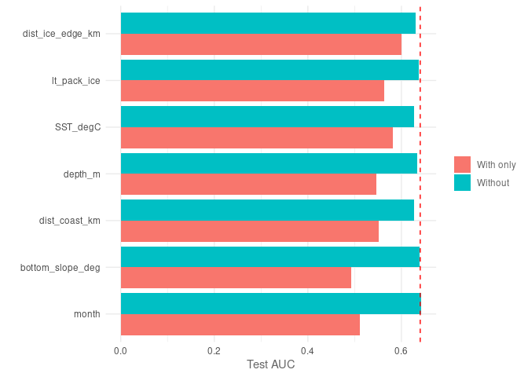
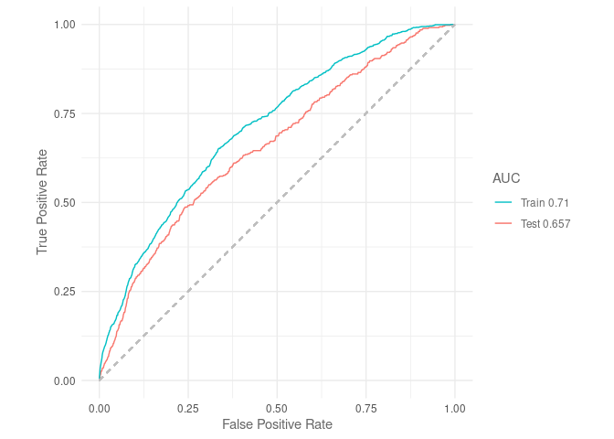
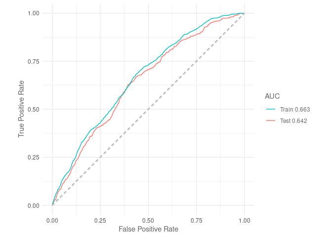
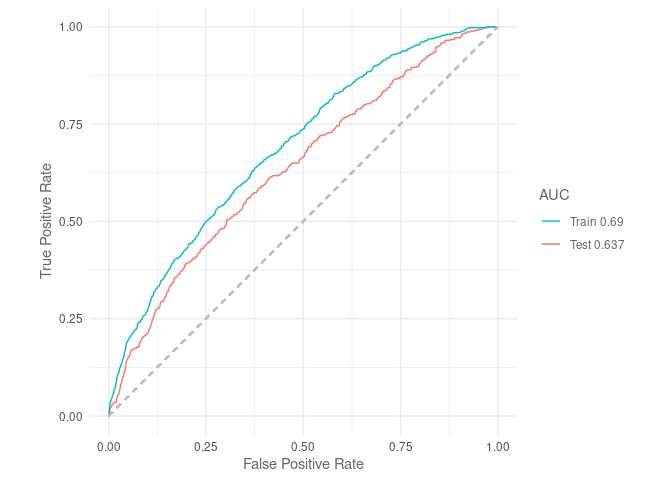
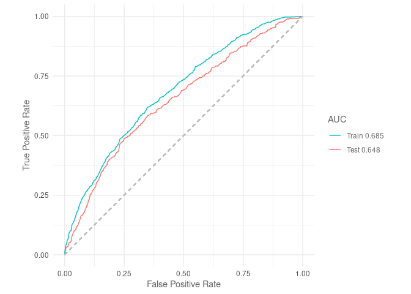
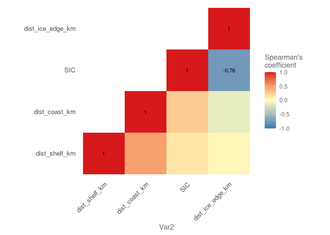

Maxent trained with simplified ACCESS-OM2-01 outputs
================
Denisse Fierro Arcos
2023-09-22

- <a href="#maxent-via-sdmtune" id="toc-maxent-via-sdmtune">Maxent via
  SDMtune</a>
  - <a href="#loading-libraries" id="toc-loading-libraries">Loading
    libraries</a>
  - <a href="#setting-up-notebook" id="toc-setting-up-notebook">Setting up
    notebook</a>
    - <a href="#loading-mean-environmental-conditions-from-access-om2-01"
      id="toc-loading-mean-environmental-conditions-from-access-om2-01">Loading
      mean environmental conditions from ACCESS-OM2-01</a>
  - <a href="#loading-layers-for-plotting"
    id="toc-loading-layers-for-plotting">Loading layers for plotting</a>
  - <a
    href="#loading-environmental-data-from-access-om2-01-and-setting-up-variables"
    id="toc-loading-environmental-data-from-access-om2-01-and-setting-up-variables">Loading
    environmental data from ACCESS-OM2-01 and setting up variables</a>
    - <a href="#environmental-variables-matching-observations"
      id="toc-environmental-variables-matching-observations">Environmental
      variables matching observations</a>
  - <a href="#modelling-and-tuning-initial-model"
    id="toc-modelling-and-tuning-initial-model">Modelling and tuning initial
    model</a>
  - <a href="#variable-importance" id="toc-variable-importance">Variable
    importance</a>
  - <a href="#jacknife-tests" id="toc-jacknife-tests">Jacknife tests</a>
    - <a href="#plotting-jacknife-results"
      id="toc-plotting-jacknife-results">Plotting Jacknife results</a>
  - <a href="#variable-correlation-multicollinearity"
    id="toc-variable-correlation-multicollinearity">Variable correlation
    (multicollinearity)</a>
  - <a href="#auc-curves" id="toc-auc-curves">AUC curves</a>
  - <a href="#true-skill-statistic-tss"
    id="toc-true-skill-statistic-tss">True Skill Statistic (TSS)</a>
  - <a href="#model-report" id="toc-model-report">Model report</a>
  - <a href="#simplifying-model" id="toc-simplifying-model">Simplifying
    model</a>
  - <a href="#removing-highly-correlated-variables"
    id="toc-removing-highly-correlated-variables">Removing highly correlated
    variables</a>
  - <a href="#training-and-tuning-model-with-reduced-variables"
    id="toc-training-and-tuning-model-with-reduced-variables">Training and
    tuning model with reduced variables</a>
  - <a href="#reduced-model-report" id="toc-reduced-model-report">Reduced
    Model Report</a>
  - <a href="#performance-metrics" id="toc-performance-metrics">Performance
    metrics</a>
  - <a href="#predictions" id="toc-predictions">Predictions</a>
    - <a href="#plotting-predictions" id="toc-plotting-predictions">Plotting
      predictions</a>

# Maxent via SDMtune

MaxEnt is one of the most widely used species distribution model
algorithm.

In this project, we will use MaxEnt as one of the models to be
considered in our Species Distribution Model ensemble to estimate the
distribution of crabeater seals in the recent past.

## Loading libraries

``` r
library(tidyverse)
library(SDMtune)
library(stars)
library(sf)
library(cmocean)
library(cowplot)
library(prg)
source("useful_functions.R")
```

## Setting up notebook

Selecting an output folder for GAM results exists and getting a list of
data files.

``` r
#Location of folder for outputs
out_folder <- "../../SDM_outputs/Maxent/Mod_match_obs"
#If folder does not exist, create one
if(!dir.exists(out_folder)){
  dir.create(out_folder, recursive = T)
}

#Get path to files containing data
file_list <- list.files("../../Environmental_Data/", pattern = "Indian", full.names = T)
```

### Loading mean environmental conditions from ACCESS-OM2-01

This dataset includes the mean environmental conditions per month
(November and December) over the entire period of study (1981 to 2013).

``` r
mean_model <- read_csv("../../Environmental_Data/ACCESS-OM2-01/All_values_month_ACCESS-OM2-01_env_vars.csv") %>% 
  mutate(month = as.factor(month)) %>% 
  #Drop variables with high multicollinearity
  select(!c(freez_pot_Wm2, bottom_sal_psu, SIT_m))
```

    ## Rows: 730244 Columns: 20
    ## ── Column specification ────────────────────────────────────────────────────────
    ## Delimiter: ","
    ## dbl (20): yt_ocean, xt_ocean, bottom_slope_deg, dist_shelf_km, dist_coast_km...
    ## 
    ## ℹ Use `spec()` to retrieve the full column specification for this data.
    ## ℹ Specify the column types or set `show_col_types = FALSE` to quiet this message.

``` r
#List of categorical variables
cat_vars <- "month"

mean_model_baked <- prep_pred(mean_model, cat_vars)
```

## Loading layers for plotting

We will extract this layer from the `rnaturalearth` package. We will
then reproject this layer to South Polar Stereographic (`EPSG 3976`).

``` r
#Loading layer
antarctica <- rnaturalearth::ne_countries(continent = "Antarctica",
                                          returnclass = "sf") %>% 
  #Transforming to South Polar Stereographic
  st_transform(3976)
```

## Loading environmental data from ACCESS-OM2-01 and setting up variables

We will use the datasets created in the notebook
`02_Merging_background_presence_data.Rmd` located within the
`Scripts/05_SDMs` folder. These datasets include the crabeater seal
observations, background points, and environmental data.

We will also define categorical and continuous explanatory variables.

### Environmental variables matching observations

First, we will look only at the variables with no multicollinearity.
This means that sea surface temperature (`SST`) is excluded even though
this variable is available in the observational dataset.

The variable `month` will be included as an ordinal factor in our
analysis.

``` r
#Loading data
mod_match_obs <- read_csv(str_subset(file_list, "match")) %>% 
  #Setting month as factor and ordered factor
  mutate(month = as.factor(month))
```

    ## Rows: 32368 Columns: 13
    ## ── Column specification ────────────────────────────────────────────────────────
    ## Delimiter: ","
    ## dbl (13): year, month, xt_ocean, yt_ocean, presence, bottom_slope_deg, dist_...
    ## 
    ## ℹ Use `spec()` to retrieve the full column specification for this data.
    ## ℹ Specify the column types or set `show_col_types = FALSE` to quiet this message.

#### Splitting data into testing and training

The `prep_data` function in the `useful_functions` script will be used
to split our data and to apply all necessary transformations. We will
then transform the data into SWD (“samples with data”) format, which is
the required format for inputs used in the `SDMtune` library.

``` r
#Getting training data
mod_match_obs <- prep_data(mod_match_obs, cat_vars, split = F)

#Applying SWD format to model data
model_data <- mod_match_obs %>% 
  select(!year) %>% 
  sdm_format() %>% 
  trainValTest(test = 0.25, only_presence = T, seed = 42)
```

## Modelling and tuning initial model

MaxEnt has different feature classes (`fc`, otherwise known as
restrictions) available for modelling. These `fc` include:  
- `l` - lineal,  
- `q` - quadratic,  
- `p` - product,  
- `t` - threshold,  
- `h` - hinge  
and any possible combination of these 5 features.

Regularisation (`reg`) refers to *L1 regularisation* also known as
*Lasso (Least Absolute Shrinkage and Selection Operator) regression*.
This involves adding an absolute value of magnitude as a penalty term to
the loss function. It is used to prevent overfitting. In MaxEnt a `reg`
value lower than 1 results in a outputs that fit closer to presence
data. The risk of using values that are too small is a model that
overfits and therefore does not generalised well. While, `reg` values
larger than 1 result in less localised predictions, producing smoother
or more diffuse distributions.

Here, we use the `SDMtune` library to test various value combinations
for regularisation, feature classes and number of iterations. We will
identify the “best model” using the `AUC` for the testing dataset.

``` r
#Train model
default_model <- train(method = "Maxent", data = model_data[[1]])

# Define the hyperparameters to test
hyp_parm <- list(reg = seq(0.5, 5, 0.5),
                 #Feature classes
                 fc = c("lq", "lh", "lqp", "lqph", "lqpht"),
                 #Number of iterations
                 iter = c(500, 1000, 1500))

# Test all the possible combinations with gridSearch
gs_mod_simp <- gridSearch(default_model, hypers = hyp_parm, metric = "auc", 
                          test = model_data[[2]])

#Check best performing models based on AUC
gs_mod_simp@results %>% 
  #Adding index as column to identify best model easily
  rownames_to_column("index") %>% 
  #Arranging results by AUC from testing data (descending order)
  arrange(-test_AUC) %>%
  #Showing only the top 5 models
  head(n = 5)

#Best model based on test AUC and smallest AUC difference between train and test
best_init_max_mod <- gs_mod_simp@models[[5]]

best_init_max_mod %>% 
  saveRDS(file.path(out_folder, "initial_Maxent_model/initial_maxent_model_grid.rds"))
```

We chose the best performing model based on the `AUC` value calculated
on the test dataset because we want the model to perform best when
applied outside the area where it was trained on.

## Variable importance

We can now check which environmental variables contributed the most
important to the model we chose. We can see that `SST` and `SIC` are the
two most important variables.

``` r
#Calculating variable contribution based on permutations
var_imp_best <- varImp(best_init_max_mod) 
```

    ## Variable importance  ■■■■                              11% | ETA:  1m - 00:00:7…Variable importance  ■■■■■■■■                          22% | ETA: 47s - 00:00:1…Variable importance  ■■■■■■■■■■■                       33% | ETA: 38s - 00:00:1…Variable importance  ■■■■■■■■■■■■■■                    44% | ETA: 31s - 00:00:25Variable importance  ■■■■■■■■■■■■■■■■■■                56% | ETA: 24s - 00:00:3…Variable importance  ■■■■■■■■■■■■■■■■■■■■■             67% | ETA: 18s - 00:00:3…Variable importance  ■■■■■■■■■■■■■■■■■■■■■■■■          78% | ETA: 12s - 00:00:4…Variable importance  ■■■■■■■■■■■■■■■■■■■■■■■■■■■■      89% | ETA:  6s - 00:00:4…Variable importance  ■■■■■■■■■■■■■■■■■■■■■■■■■■■■■■■  100% | ETA:  0s - 00:00:5…

``` r
#Plotting results
var_imp_best %>% 
  plotVarImp()
```

<!-- -->

## Jacknife tests

We know that `SST` and `SIC` are highly correlated in the ACCESS-OM2-01
model, so we will perform jacknife tests to assess the importance of
removing a variable from the model. This way we can identify which of
these two variables we could leave out from our final model.

``` r
jk_mod_match_obs <- doJk(best_init_max_mod, metric = "auc", test = model_data[[2]])
```

    ## Loading required namespace: rJava

    ## Jk Test  ■■■                                6% | ETA:  9m - 00:00:31.6Jk Test  ■■■■                              11% | ETA:  4m - 00:00:32.5Jk Test  ■■■■■■                            17% | ETA:  5m - 00:00:55.1Jk Test  ■■■■■■■■                          22% | ETA:  3m - 00:00:55.9Jk Test  ■■■■■■■■■                         28% | ETA:  3m - 00:01:16.2Jk Test  ■■■■■■■■■■■                       33% | ETA:  3m - 00:01:18.8Jk Test  ■■■■■■■■■■■■■                     39% | ETA:  3m - 00:01:39.2Jk Test  ■■■■■■■■■■■■■■                    44% | ETA:  2m - 00:01:41.7Jk Test  ■■■■■■■■■■■■■■■■                  50% | ETA:  2m - 00:02:0.7 Jk Test  ■■■■■■■■■■■■■■■■■■                56% | ETA:  2m - 00:02:3.3Jk Test  ■■■■■■■■■■■■■■■■■■■               61% | ETA:  2m - 00:02:22 Jk Test  ■■■■■■■■■■■■■■■■■■■■■             67% | ETA:  1m - 00:02:25.8Jk Test  ■■■■■■■■■■■■■■■■■■■■■■■           72% | ETA:  1m - 00:02:44.2Jk Test  ■■■■■■■■■■■■■■■■■■■■■■■■          78% | ETA: 48s - 00:02:47.1Jk Test  ■■■■■■■■■■■■■■■■■■■■■■■■■■        83% | ETA: 38s - 00:03:10.6Jk Test  ■■■■■■■■■■■■■■■■■■■■■■■■■■■■      89% | ETA: 24s - 00:03:11.3Jk Test  ■■■■■■■■■■■■■■■■■■■■■■■■■■■■■     94% | ETA: 12s - 00:03:30.6Jk Test  ■■■■■■■■■■■■■■■■■■■■■■■■■■■■■■■  100% | ETA:  0s - 00:03:34  

``` r
jk_mod_match_obs
```

    ##           Variable Train_AUC_without Train_AUC_withonly Test_AUC_without
    ## 1            month         0.7415778          0.5091150        0.6677697
    ## 2 bottom_slope_deg         0.7405972          0.5363608        0.6645401
    ## 3    dist_shelf_km         0.7336671          0.5791114        0.6615635
    ## 4    dist_coast_km         0.7308987          0.5790173        0.6616179
    ## 5          depth_m         0.7251377          0.5867251        0.6626793
    ## 6              SIC         0.7203054          0.6133796        0.6425771
    ## 7         SST_degC         0.7122586          0.6290092        0.6556570
    ## 8      lt_pack_ice         0.7396322          0.5679415        0.6635630
    ## 9 dist_ice_edge_km         0.7310775          0.6112631        0.6593157
    ##   Test_AUC_withonly
    ## 1         0.5104806
    ## 2         0.4929697
    ## 3         0.5649179
    ## 4         0.5517255
    ## 5         0.5466619
    ## 6         0.5888631
    ## 7         0.5814377
    ## 8         0.5638401
    ## 9         0.5995086

### Plotting Jacknife results

We can plot this information so we can compare the importance across all
variables included in the model. We can plot this information based on
the training dataset.

``` r
plotJk(jk_mod_match_obs, type = "train", ref = auc(best_init_max_mod))
```

<!-- -->

We can see that `SST` when used by itself has the highest accuracy gain,
followed by `SIC`. When `SST` was removed, it resulted in the largest
decrease in AUC followed by a removal of `SIC`. Now, we will consider
the importance of variables calculated from the testing dataset.

On the other hand, the slope of the sea floor (`bottom_slope_deg`) and
the `month` of the year are the two variables with the lowest
contribution to accuracy. Their removal almost has no effect on model
performance.

``` r
plotJk(jk_mod_match_obs, type = "test", ref = auc(best_init_max_mod, test = model_data[[2]]))
```

<!-- -->

The results are slightly different from the testing dataset perspective.
Here, we see that the use of `SIC` improved the model accuracy the most,
closely followed by `SST`.

The slope of the sea floor (`bottom_slope_deg`) and the `month` of the
year are also the two variables with the lowest contribution to
accuracy. Their removal almost has no effect on model performance.

Based on this information, we could simplify the model by removing the
`bottom_slope_deg` and `month` from the model. Additionally, we can test
the model performance without `SST` since this variable is highly
correlated to `SIC` and its removal leads to slightly less accuracy loss
than removing `SIC`.

## Variable correlation (multicollinearity)

Before removing any variables, we can confirm if multicollinearity is
present in our data.

``` r
plotCor(model_data[[1]], method = "spearman", cor_th = 0.75)
```

<!-- -->

We can confirm that `SST` and `SIC` are highly correlated. Additionally,
distance to the continental shelf (`dist_shelf_km`) and `depth`,
long-term presence of pack ice (`lt_pack_ice`) and distance to the sea
ice edge (`dist_ice_edge_km`), and `SIC` and `dist_ice_edge_km` are
highly correlated.

Based on this information and the results from variable importance, we
can test the effect on model performance of removing variables with a
contribution to the model of 5% or less. This includes the slope of the
sea floor (`bottom_slope_deg`), `month`, and long-term presence of pack
ice (`lt_pack_ice`).

## AUC curves

We will calculate AUC curves, so we can compare to the simplified models
we will test.

``` r
plotROC(best_init_max_mod, test = model_data[[2]])
```

    ## Warning: The following aesthetics were dropped during statistical transformation: m, d
    ## ℹ This can happen when ggplot fails to infer the correct grouping structure in
    ##   the data.
    ## ℹ Did you forget to specify a `group` aesthetic or to convert a numerical
    ##   variable into a factor?

<!-- -->

## True Skill Statistic (TSS)

This is a measure of predictive accuracy, which captures the proportion
of correctly classified cells as true absences (specificity) or true
presences (sensitivity). The TSS provides a normalised value of model
accuracy so that it can be compared to accuracy by chance alone.

TSS values between 0.4 and 0.7 indicate a good model performance. Below
this range, TSS indicates poor model performance, and above this range
are models with excellent performance.

``` r
tss(best_init_max_mod)
```

    ## [1] 0.335476

This model does not have a good performance, which agrees with a rather
low AUC value of 0.67.

## Model report

Before moving onto testing a new model, we will save a report with the
information shown above.

``` r
out <- file.path(out_folder, "initial_Maxent_model")
#If folder does not exist, create one
if(!dir.exists(out_folder)){
  dir.create(out_folder, recursive = T)
}

#Produce report
modelReport(best_init_max_mod, type = "cloglog", folder = out, test = model_data[[2]], 
            response_curves = T, only_presence = T, jk = T)
```

## Simplifying model

We will now remove the variables that contributed the least to the
model. The code below will remove one variable at a time, train the
model and recalculate AUC.

``` r
reduced_model <- reduceVar(best_init_max_mod, metric = "auc", test = model_data[[2]],
                          th = 5, permut = 10, use_jk = T)
```

    ## ✔ The variables month and bottom_slope_deg have been removed

``` r
reduced_model
```

    ## 

    ## ── Object of class: <SDMmodel> ──

    ## 

    ## Method: Maxent

    ## 

    ## ── Hyperparameters

    ## • fc: "lqpht"

    ## • reg: 0.5

    ## • iter: 500

    ## 

    ## ── Info

    ## • Species: Crabeater seals

    ## • Presence locations: 1381

    ## • Absence locations: 30527

    ## 

    ## ── Variables

    ## • Continuous: "dist_shelf_km", "dist_coast_km", "depth_m", "SIC", "SST_degC",
    ## "lt_pack_ice", and "dist_ice_edge_km"

    ## • Categorical: NA

By setting the parameter `use_jk` to `TRUE`, a variable is only removed
if it does not decrease the model performance. In this case, the three
variables we considered for removal have been removed without adversely
affecting our model.

We have identified three variables that we can remove without affecting
the predictive performance of the model: `month` and the slope of the
seafloor (`bottom_slope_deg`). However, we still have some variables
that were highly correlated: distance to continental shelf
(`dist_shelf_km`) and depth (`depth_m`), `SIC` and distance to the sea
ice edge (`dist_ice_edge_km`), and sea surface temperature (`SST_degC`)
and `SIC`.

As explained in previous notebooks, multicollinearity negatively impacts
the predictive ability of Maxent. We will now check the effect of
excluding the highly correlated variables. All other parameters in the
model will remain the same, and we will calculate AUC for each new model
to decide which model is best.

## Removing highly correlated variables

First, we will start by removing the three variables identified as not
significantly contributing to the model `month` and the slope of the
seafloor (`bottom_slope_deg`), as well as `depth_m`. Then, we will
remove long-term pack ice presence (`depth_m`) and calculate AUC values
and ROC curves. We start with depth because even though it was ranked as
more important than distance to the shelf, with which is highly
correlated, depth contributes slightly less to model perfomance when
used on its own (jacknife tests for testing data).

``` r
#Dataset for training and testing - excluding low contribution variables and depth
model_data_nodepth <- mod_match_obs %>% 
  select(!c(year, month, bottom_slope_deg, depth_m)) %>% 
  sdm_format() %>% 
  trainValTest(test = 0.25, only_presence = T, seed = 42)

#Train model
simple_model_nodepth <- train(method = "Maxent", fc = "lqpht", reg = 0.5, iter = 500,
                               data = model_data_nodepth[[1]])

#Plot ROC curves
plotROC(simple_model_nodepth, test = model_data_nodepth[[2]])
```

    ## Warning: The following aesthetics were dropped during statistical transformation: m, d
    ## ℹ This can happen when ggplot fails to infer the correct grouping structure in
    ##   the data.
    ## ℹ Did you forget to specify a `group` aesthetic or to convert a numerical
    ##   variable into a factor?

<!-- -->

For reference, the AUC from the original model we are testing against
was `0.666` (against testing dataset). By removing `depth`, the AUC
remained the same `0.666` (testing data). We will remove `depth` from
the final model, and we will also test the effect of removing distance
to the sea ice edge.

``` r
#Dataset for training and testing - excluding low contribution variables, depth and distance to sea ice edge
model_data_noedge <- mod_match_obs %>% 
  select(!c(year, month, bottom_slope_deg, depth_m, dist_ice_edge_km)) %>% 
  sdm_format() %>% 
  trainValTest(test = 0.25, only_presence = T, seed = 42)

#Train model
simple_model_noedge <- train(method = "Maxent", fc = "lqpht", reg = 0.5, iter = 500,
                               data = model_data_noedge[[1]])

#Plot ROC curves
plotROC(simple_model_noedge, test = model_data_noedge[[2]])
```

    ## Warning: The following aesthetics were dropped during statistical transformation: m, d
    ## ℹ This can happen when ggplot fails to infer the correct grouping structure in
    ##   the data.
    ## ℹ Did you forget to specify a `group` aesthetic or to convert a numerical
    ##   variable into a factor?

<!-- -->

Removing the distance to the sea ice edge (`dist_ice_edge_km`) reduces
the model performance slightly, from `0.666` to `0.657`. Now we will
check what is the impact of removing long-term presence of ice
(`lt_pack_ice`).

``` r
#Dataset for training and testing - excluding low contribution variables, depth and distance to sea ice edge
model_data_noltice <- mod_match_obs %>% 
  select(!c(year, month, bottom_slope_deg, depth_m, lt_pack_ice)) %>% 
  sdm_format() %>% 
  trainValTest(test = 0.25, only_presence = T, seed = 42)

#Train model
simple_model_noltice <- train(method = "Maxent", fc = "lqpht", reg = 0.5, iter = 500,
                               data = model_data_noltice[[1]])

#Plot ROC curves
plotROC(simple_model_noltice, test = model_data_noltice[[2]])
```

    ## Warning: The following aesthetics were dropped during statistical transformation: m, d
    ## ℹ This can happen when ggplot fails to infer the correct grouping structure in
    ##   the data.
    ## ℹ Did you forget to specify a `group` aesthetic or to convert a numerical
    ##   variable into a factor?

<!-- -->

The removal of long-term sea ice presence has less of an effect on AUC,
so we will remove this variable from the final model. Now will test the
effect of removing `SST` and `SIC`.

``` r
#Dataset for training and testing - excluding low contribution variables, depth and SST
model_data_noSST <- mod_match_obs %>% 
  select(!c(year, month, bottom_slope_deg, depth_m, lt_pack_ice, SST_degC)) %>% 
  sdm_format() %>% 
  trainValTest(test = 0.25, only_presence = T, seed = 42)

#Train model
simple_model_noSST <- train(method = "Maxent", fc = "lqpht", reg = 0.5, iter = 500,
                               data = model_data_noSST[[1]])

#Plot ROC curves
plotROC(simple_model_noSST, test = model_data_noSST[[2]])
```

    ## Warning: The following aesthetics were dropped during statistical transformation: m, d
    ## ℹ This can happen when ggplot fails to infer the correct grouping structure in
    ##   the data.
    ## ℹ Did you forget to specify a `group` aesthetic or to convert a numerical
    ##   variable into a factor?

<!-- -->

Removing `SST` resulting in a decline in AUC from 0.662 to 0.648. We
will test the effect of removing `SIC`.

``` r
#Dataset for training and testing - excluding low contribution variables, depth and SIC
model_data_noSIC <- mod_match_obs %>% 
  select(!c(year, month, bottom_slope_deg, depth_m, lt_pack_ice, SIC)) %>% 
  sdm_format() %>% 
  trainValTest(test = 0.25, only_presence = T, seed = 42)

#Train model
simple_model_noSIC <- train(method = "Maxent", fc = "lqpht", reg = 0.5, iter = 500,
                               data = model_data_noSIC[[1]])

#Plot ROC curves
plotROC(simple_model_noSIC, test = model_data_noSIC[[2]])
```

    ## Warning: The following aesthetics were dropped during statistical transformation: m, d
    ## ℹ This can happen when ggplot fails to infer the correct grouping structure in
    ##   the data.
    ## ℹ Did you forget to specify a `group` aesthetic or to convert a numerical
    ##   variable into a factor?

<!-- -->

The removal of `SIC` has a higher impact on model performance, with AUC
reducing to 0.637. However, if we keep `SIC`, we will also need to
consider removing long-term presence of ice (`lt_pack_ice`) because SIC
is also highly correlated to this variable.

Let’s remove both `SST` and `lt_pack_ice` and compare it to the model
performance of removing only `SIC`.

``` r
#Dataset for training and testing - excluding low contribution variables, depth and SST
model_data_noSST_ltice <- mod_match_obs %>% 
  select(!c(year, month, bottom_slope_deg, depth_m, lt_pack_ice, SST_degC, lt_pack_ice)) %>% 
  sdm_format() %>% 
  trainValTest(test = 0.25, only_presence = T, seed = 42)

#Train model
simple_model_noSST_ltice <- train(method = "Maxent", fc = "lqpht", reg = 0.5, iter = 500,
                               data = model_data_noSST_ltice[[1]])

#Plot ROC curves
plotROC(simple_model_noSST_ltice, test = model_data_noSST_ltice[[2]])
```

    ## Warning: The following aesthetics were dropped during statistical transformation: m, d
    ## ℹ This can happen when ggplot fails to infer the correct grouping structure in
    ##   the data.
    ## ℹ Did you forget to specify a `group` aesthetic or to convert a numerical
    ##   variable into a factor?

<!-- -->

Removing `SST` and `lt_pack_ice` results in better AUC (0.648) than
removing SIC (0.637). So we will remove them from our final model. To
ensure that we have dealt with multicollinearity in our data, we will
produce a correlation plot once more.

``` r
plotCor(model_data_noSST_ltice[[1]], method = "spearman", cor_th = 0.75)
```

<!-- -->

No multicollinearity was detected, now we can check if the model
hyperparameters need updating with the reduced number of environmental
variables.

## Training and tuning model with reduced variables

``` r
#Train model
default_model <- train(method = "Maxent", data = model_data_noSST_ltice[[1]])

# Test all the possible hyper parameter combinations with gridSearch
gs_mod <- gridSearch(default_model, hypers = hyp_parm, metric = "auc", 
                     test = model_data_noSST_ltice[[2]])

#Check best performing models based on AUC
gs_mod@results %>% 
  #Adding index as column to identify best model easily
  rownames_to_column("index") %>% 
  #Arranging results by AUC from testing data (descending order)
  arrange(-test_AUC) %>% 
  #Showing only the top 5 models
  head(n = 5)

#Best model based on test AUC and smallest AUC difference between train and test
best_max_mod <- gs_mod@models[[55]]

best_max_mod %>% 
  saveRDS(file.path(out_folder, "reduced_Maxent_model/best_red_maxent_model.rds"))
```

## Variable importance
  
``` r
#Calculating variable contribution based on permutations
var_imp_best <- varImp(best_max_mod) 

#Plotting results
p <- var_imp_best %>% 
  plotVarImp()

ggsave(file.path(out_folder, "var_import_mod_match_obs.png"), p, 
       device = "png")
```

## Reduced Model Report

``` r
#Ensuring output folder exists
out <- file.path(out_folder, "reduced_Maxent_model")
#If folder does not exist, create one
if(!dir.exists(out_folder)){
  dir.create(out_folder, recursive = T)
}

modelReport(best_max_mod, type = "cloglog", folder = out, test = model_data_noSST_ltice[[2]], 
            response_curves = T, only_presence = T, jk = T)
```

## Performance metrics

To be able to compare the performance of this model with the three other
SDM algorithms to be used in the SDM ensemble, we will calculate three
metrics: area under the receiver operating curve ($AUC_{ROC}$), area
under the precisison-recall gain curve ($AUC_{PRG}$) and the Pearson
correlation between the model predictions and the testing dataset.

``` r
#Predicting values using testing dataset
pred <- predict(best_max_mod, model_data[[2]]@data, type = "cloglog")

#AUC ROC
auc_roc <- auc(best_max_mod, model_data[[2]])

#AUC PRG
auc_prg <- create_prg_curve(model_data[[2]]@pa, pred) %>% 
  calc_auprg()

#Pearson correlation
cor <- cor(pred, model_data[[2]]@pa)

#Load model evaluation data frame and add results
model_eval_path <- "../../SDM_outputs/model_evaluation.csv"
model_eval <- read_csv(model_eval_path) %>% 
  bind_rows(data.frame(model = "Maxent", env_trained = "mod_match_obs", auc_roc = auc_roc, 
                       auc_prg = auc_prg, pear_cor = cor)) %>% 
  write_csv(model_eval_path)
```

    ## Rows: 3 Columns: 5
    ## ── Column specification ────────────────────────────────────────────────────────
    ## Delimiter: ","
    ## chr (2): model, env_trained
    ## dbl (3): auc_roc, auc_prg, pear_cor
    ## 
    ## ℹ Use `spec()` to retrieve the full column specification for this data.
    ## ℹ Specify the column types or set `show_col_types = FALSE` to quiet this message.

``` r
print(c(paste0("AUC ROC: ", round(auc_roc, 3)),
        paste0("AUC PRG: ", round(auc_prg, 3)),
        paste0("Pearson correlation: ", round(cor, 3))))
```

    ## [1] "AUC ROC: 0.648"             "AUC PRG: 0.713"            
    ## [3] "Pearson correlation: 0.062"

## Predictions

Finally, we will use this reduced model to predict crabeater seals
distribution.

``` r
pred_mod_match_obs <- mean_model_baked %>% 
  drop_na() %>% 
  mutate(pred = as.vector(predict(best_max_mod,
                                  data = mean_model_baked,
                                  type = "cloglog")))

pred_mod_match_obs_ras <- pred_mod_match_obs %>% 
  #Select relevant variables only
  select(xt_ocean, yt_ocean, pred, month) %>% 
  right_join(mean_model_baked %>%
  #Select relevant variables only
  select(xt_ocean, yt_ocean, month)) %>% 
  #Set dimensions
  st_as_stars(dims = c("xt_ocean", "yt_ocean", "month")) %>% 
  #Ensuring month dimension is shown correctly
  st_set_dimensions("month", values = c(11, 12)) %>%
  #Set CRS
  st_set_crs(4326) %>% 
  #Transform to South Pole stereographic
  st_transform(crs = st_crs(3976))

#Saving outputs
#Data frame
pred_mod_match_obs %>% 
  write_csv(file.path(out_folder, "reduced_Maxent_model/mean_pred_match_obs.csv"))
#Saving as R dataset so it can be easily open with readRDS
saveRDS(pred_mod_match_obs_ras,
        file.path(out_folder, "reduced_Maxent_model/mean_pred_match_obs_raster.rds"))
```

### Plotting predictions

``` r
#Plotting November distribution
#Prepping data
nov <- pred_mod_match_obs_ras %>% 
  slice(index = 1, along = "month") 

#Plotting
nov_plot <- ggplot()+
  geom_stars(data = nov)+
  geom_sf(data = antarctica)+
  lims(x = c(0, 4000000))+
  #Set colour palette
  scale_fill_cmocean(name = "haline", direction = -1, 
                     guide = guide_colorbar(barwidth = 1, barheight = 10, 
                                            ticks = FALSE, nbin = 1000, 
                                            frame.colour = "black"), 
                     limits = c(0, 1)) +
  theme_linedraw() +
  theme(panel.background = element_blank(),
        panel.grid.major = element_blank(),
        panel.grid.minor = element_blank(), 
        legend.position = "none",
        plot.title = element_text(hjust = 0.5)) +
  labs(title = "November",
       x = "Longitude",
       y = "Latitude")

dec <- pred_mod_match_obs_ras %>% 
  slice(index = 2, along = "month") 

dec_plot <- ggplot() +
  geom_stars(data = dec) +
  geom_sf(data = antarctica)+
  lims(x = c(0, 4000000))+
  scale_fill_cmocean(name = "haline", direction = -1, 
                     guide = guide_colorbar(barwidth = 1, barheight = 10, 
                                            ticks = FALSE, nbin = 1000, 
                                            frame.colour = "black"), 
                     limits = c(0, 1)) +
  theme_linedraw() +
  theme(panel.background = element_blank(),
        panel.grid.major = element_blank(),
        panel.grid.minor = element_blank(), 
        plot.title = element_text(hjust = 0.5)) +
  labs(title = "December",
       x = "Longitude",
       y = " ",
       fill = "Probability")

#Get legend
legend <- get_legend(dec_plot)

#Remove legend from December plot
dec_plot <- dec_plot + theme(legend.position = 'none')

#Plotting together
plot_match_obs <- plot_grid(nov_plot, dec_plot, legend, ncol = 3, nrow = 1,
                            rel_widths = c(1, 1, 0.3))

#Add title
title <- ggdraw()+
  draw_label("Mean crabeater seal distribution\n(ACCESS-OM2-01 - simplified)",
             fontface = "bold", hjust = 0.5)+
  theme(plot.margin = margin(0, 0, 0, 0))

#Putting everything together
final <- plot_grid(title, plot_match_obs, ncol = 1, rel_heights = c(0.1, 1))

#Saving graph
ggsave(file.path(out_folder, "map_mean_pred_match_obs.png"), 
       plot = final, device = "png", bg = "white", width = 8.75, height = 7)
```
