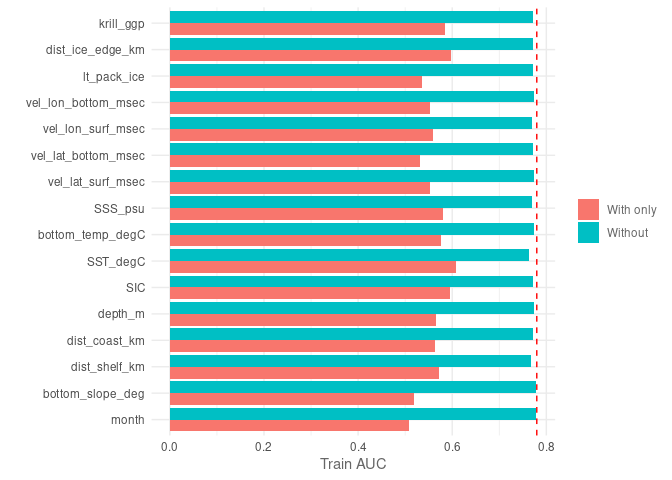
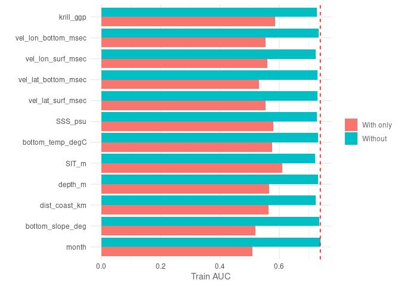
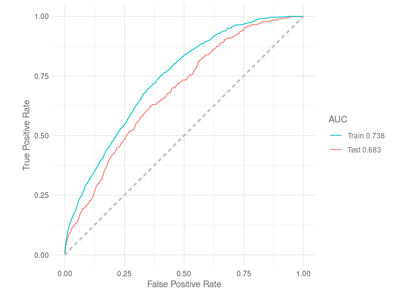
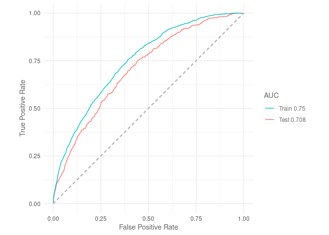
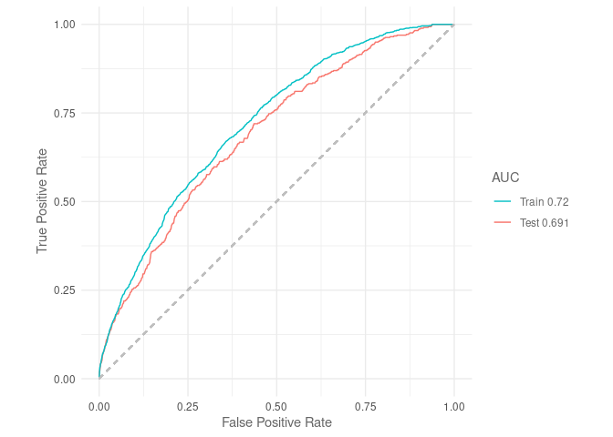

Maxent trained with ACCESS-OM2-01 outputs
================
Denisse Fierro Arcos
2023-11-02

- <a href="#maxent-via-sdmtune" id="toc-maxent-via-sdmtune">Maxent via
  SDMtune</a>
  - <a href="#loading-libraries" id="toc-loading-libraries">Loading
    libraries</a>
  - <a href="#setting-up-notebook" id="toc-setting-up-notebook">Setting up
    notebook</a>
    - <a href="#loading-mean-environmental-conditions-from-access-om2-01"
      id="toc-loading-mean-environmental-conditions-from-access-om2-01">Loading
      mean environmental conditions from ACCESS-OM2-01</a>
  - <a href="#loading-layers-for-plotting"
    id="toc-loading-layers-for-plotting">Loading layers for plotting</a>
  - <a
    href="#loading-environmental-data-from-access-om2-01-and-setting-up-variables"
    id="toc-loading-environmental-data-from-access-om2-01-and-setting-up-variables">Loading
    environmental data from ACCESS-OM2-01 and setting up variables</a>
    - <a
      href="#full-suite-of-environmental-variables-available-in-access-om2-01"
      id="toc-full-suite-of-environmental-variables-available-in-access-om2-01">Full
      suite of environmental variables available in ACCESS-OM2-01</a>
  - <a href="#variable-importance" id="toc-variable-importance">Variable
    importance</a>
  - <a href="#jacknife-tests" id="toc-jacknife-tests">Jacknife tests</a>
    - <a href="#plotting-jacknife-results"
      id="toc-plotting-jacknife-results">Plotting Jacknife results</a>
  - <a href="#variable-correlation-multicollinearity"
    id="toc-variable-correlation-multicollinearity">Variable correlation
    (multicollinearity)</a>
  - <a href="#auc-curves" id="toc-auc-curves">AUC curves</a>
  - <a href="#true-skill-statistic-tss"
    id="toc-true-skill-statistic-tss">True Skill Statistic (TSS)</a>
  - <a href="#model-report" id="toc-model-report">Model report</a>
  - <a href="#reducing-model-variables"
    id="toc-reducing-model-variables">Reducing model variables</a>
  - <a href="#removing-highly-correlated-variables"
    id="toc-removing-highly-correlated-variables">Removing highly correlated
    variables</a>
  - <a href="#training-model-with-reduced-variables"
    id="toc-training-model-with-reduced-variables">Training model with
    reduced variables</a>
  - <a href="#model-report-1" id="toc-model-report-1">Model report</a>
  - <a href="#performance-metrics" id="toc-performance-metrics">Performance
    metrics</a>
  - <a href="#predictions" id="toc-predictions">Predictions</a>
    - <a href="#plotting-predictions" id="toc-plotting-predictions">Plotting
      predictions</a>

# Maxent via SDMtune

MaxEnt is one of the most widely used species distribution model
algorithm.

In this project, we will use MaxEnt as one of the models to be
considered in our Species Distribution Model ensemble to estimate the
distribution of crabeater seals in the recent past.

## Loading libraries

``` r
library(tidyverse)
library(SDMtune)
library(stars)
library(sf)
library(cmocean)
library(cowplot)
library(prg)
source("useful_functions.R")
```

## Setting up notebook

Selecting an output folder for GAM results exists and getting a list of
data files.

``` r
#Location of folder for outputs
out_folder <- "../../SDM_outputs/Maxent/Mod_full"
#If folder does not exist, create one
if(!dir.exists(out_folder)){
  dir.create(out_folder, recursive = T)
}

#Get path to files containing data
file_list <- list.files("../../Environmental_Data/", pattern = "Indian", full.names = T)
```

### Loading mean environmental conditions from ACCESS-OM2-01

This dataset includes the mean environmental conditions per month
(November and December) over the entire period of study (1981 to 2013).

``` r
mean_model <- read_csv("../../Environmental_Data/ACCESS-OM2-01/All_values_month_ACCESS-OM2-01_env_vars.csv") %>% 
  mutate(month = as.factor(month)) %>% 
  #Drop variables with high multicollinearity
  select(!c(freez_pot_Wm2, bottom_sal_psu, SIT_m))
```

    ## Rows: 730244 Columns: 20
    ## ── Column specification ────────────────────────────────────────────────────────
    ## Delimiter: ","
    ## dbl (20): yt_ocean, xt_ocean, bottom_slope_deg, dist_shelf_km, dist_coast_km...
    ## 
    ## ℹ Use `spec()` to retrieve the full column specification for this data.
    ## ℹ Specify the column types or set `show_col_types = FALSE` to quiet this message.

``` r
#List of categorical variables
cat_vars <- "month"

mean_model_baked <- prep_pred(mean_model, cat_vars)
```

## Loading layers for plotting

We will extract this layer from the `rnaturalearth` package. We will
then reproject this layer to South Polar Stereographic (`EPSG 3976`).

``` r
#Loading layer
antarctica <- rnaturalearth::ne_countries(continent = "Antarctica",
                                          returnclass = "sf") %>% 
  #Transforming to South Polar Stereographic
  st_transform(3976)
```

## Loading environmental data from ACCESS-OM2-01 and setting up variables

We will use the datasets created in the notebook
`02_Merging_background_presence_data.Rmd` located within the
`Scripts/05_SDMs` folder. These datasets include the crabeater seal
observations, background points, and environmental data.

We will also define categorical and continuous explanatory variables.

### Full suite of environmental variables available in ACCESS-OM2-01

First, we will look only at the variables with no multicollinearity.
This means that sea surface temperature (`SST`) is excluded even though
this variable is available in the observational dataset.

The variable `month` will be included as an ordinal factor in our
analysis.

``` r
#Loading data
mod_data <- read_csv(str_subset(file_list, "model")) %>% 
  #Setting month as factor and ordered factor
  mutate(month = as.factor(month)) %>% 
  #Drop variables with high multicollinearity
  select(!c(freez_pot_Wm2, bottom_sal_psu, SIT_m))
```

    ## Rows: 32368 Columns: 22
    ## ── Column specification ────────────────────────────────────────────────────────
    ## Delimiter: ","
    ## dbl (22): year, month, xt_ocean, yt_ocean, presence, bottom_slope_deg, dist_...
    ## 
    ## ℹ Use `spec()` to retrieve the full column specification for this data.
    ## ℹ Specify the column types or set `show_col_types = FALSE` to quiet this message.

#### Splitting data into testing and training

The `prep_data` function in the `useful_functions` script will be used
to split our data and to apply all necessary transformations. We will
then transform the data into SWD (“samples with data”) format, which is
the required format for inputs used in the `SDMtune` library.

``` r
#Getting training data
mod <- prep_data(mod_data, cat_vars, split = F)

#Applying SWD format to model data
model_data <- mod %>% 
  select(!year) %>% 
  sdm_format() %>% 
  trainValTest(test = 0.25, only_presence = T, seed = 42)
```

#### Modelling

MaxEnt has different feature classes (`fc`, otherwise known as
restrictions) available for modelling. These `fc` include:  
- `l` - lineal,  
- `q` - quadratic,  
- `p` - product,  
- `t` - threshold,  
- `h` - hinge  
and any possible combination of these 5 features.

Regularisation (`reg`) refers to *L1 regularisation* also known as
*Lasso (Least Absolute Shrinkage and Selection Operator) regression*.
This involves adding an absolute value of magnitude as a penalty term to
the loss function. It is used to prevent overfitting. In MaxEnt a `reg`
value lower than 1 results in a outputs that fit closer to presence
data. The risk of using values that are too small is a model that
overfits and therefore does not generalised well. While, `reg` values
larger than 1 result in less localised predictions, producing smoother
or more diffuse distributions.

Here, we use the `SDMtune` library to test various value combinations
for regularisation, feature classes and number of iterations. We will
identify the “best model” using the `AUC` for the testing dataset.

``` r
#Train model
default_model <- train(method = "Maxent", data = model_data[[1]])

# Define the hyperparameters to test
hyp_parm <- list(reg = seq(0.5, 5, 0.5),
                 #Feature classes
                 fc = c("lq", "lh", "lqp", "lqph", "lqpht"),
                 #Number of iterations
                 iter = c(500, 1000, 1500))

# Test all the possible combinations with gridSearch
gs_mod <- gridSearch(default_model, hypers = hyp_parm, metric = "auc", 
                          test = model_data[[2]])

#Check best performing models based on AUC
gs_mod@results %>% 
  #Adding index as column to identify best model easily
  rownames_to_column("index") %>% 
  #Arranging results by AUC from testing data (descending order)
  arrange(-test_AUC) %>% 
  #Showing only the top 5 models
  head(n = 5)

#Best model based on test AUC and smallest AUC difference between train and test
best_max_mod <- gs_mod@models[[110]]

best_max_mod %>% 
  saveRDS(file.path(out_folder, "initial_Maxent_model/best_maxent_model_grid.rds"))
```

## Variable importance

We can check the contribution of each environmental variable to model
performance.

``` r
var_imp_best <- varImp(best_max_mod) 
```

    ## Variable importance  ■■■                                7% | ETA:  2m - 00:00:9…Variable importance  ■■■■■                             13% | ETA:  2m - 00:00:1…Variable importance  ■■■■■■■                           20% | ETA:  2m - 00:00:2…Variable importance  ■■■■■■■■■                         27% | ETA:  1m - 00:00:2…Variable importance  ■■■■■■■■■■■                       33% | ETA:  1m - 00:00:3…Variable importance  ■■■■■■■■■■■■■                     40% | ETA:  1m - 00:00:4…Variable importance  ■■■■■■■■■■■■■■■                   47% | ETA:  1m - 00:00:4…Variable importance  ■■■■■■■■■■■■■■■■■                 53% | ETA: 48s - 00:00:5…Variable importance  ■■■■■■■■■■■■■■■■■■■               60% | ETA: 41s - 00:01:1…Variable importance  ■■■■■■■■■■■■■■■■■■■■■             67% | ETA: 34s - 00:01:7…Variable importance  ■■■■■■■■■■■■■■■■■■■■■■■           73% | ETA: 27s - 00:01:1…Variable importance  ■■■■■■■■■■■■■■■■■■■■■■■■■         80% | ETA: 20s - 00:01:2…Variable importance  ■■■■■■■■■■■■■■■■■■■■■■■■■■■       87% | ETA: 13s - 00:01:2…Variable importance  ■■■■■■■■■■■■■■■■■■■■■■■■■■■■■     93% | ETA:  7s - 00:01:3…Variable importance  ■■■■■■■■■■■■■■■■■■■■■■■■■■■■■■■  100% | ETA:  0s - 00:01:4…

``` r
var_imp_best %>% 
  plotVarImp()
```

<!-- -->

Just as we saw in the previous notebook, `SST` is the most important
variable for this Maxent model, followed by `SIC`. However, with the
full suite of variables, the difference in importance between these two
variables is much larger.

## Jacknife tests

We can now check which environmental variables contributed the most to
the Maxent model. This is important because we know both `SIC` and `SST`
are highly correlated and this will help us decide which variable to
keep in the final model.

``` r
jk_mod <- doJk(best_max_mod, metric = "auc", test = model_data[[2]])
```

    ## Loading required namespace: rJava

    ## Jk Test  ■■                                 3% | ETA:  1h - 00:02:16.2Jk Test  ■■■                                7% | ETA: 32m - 00:02:16.8Jk Test  ■■■■                              10% | ETA: 40m - 00:04:27.7Jk Test  ■■■■■                             13% | ETA: 29m - 00:04:28.4Jk Test  ■■■■■■                            17% | ETA: 32m - 00:06:25.6Jk Test  ■■■■■■■                           20% | ETA: 26m - 00:06:26.7Jk Test  ■■■■■■■■                          23% | ETA: 28m - 00:08:26.1Jk Test  ■■■■■■■■■                         27% | ETA: 23m - 00:08:26.9Jk Test  ■■■■■■■■■■                        30% | ETA: 25m - 00:10:31  Jk Test  ■■■■■■■■■■■                       33% | ETA: 21m - 00:10:32.3Jk Test  ■■■■■■■■■■■■                      37% | ETA: 21m - 00:12:24.5Jk Test  ■■■■■■■■■■■■■                     40% | ETA: 19m - 00:12:26  Jk Test  ■■■■■■■■■■■■■■                    43% | ETA: 19m - 00:14:22.7Jk Test  ■■■■■■■■■■■■■■■                   47% | ETA: 17m - 00:14:26.5Jk Test  ■■■■■■■■■■■■■■■■                  50% | ETA: 16m - 00:16:25.3Jk Test  ■■■■■■■■■■■■■■■■■                 53% | ETA: 14m - 00:16:26.3Jk Test  ■■■■■■■■■■■■■■■■■■                57% | ETA: 14m - 00:18:18  Jk Test  ■■■■■■■■■■■■■■■■■■■               60% | ETA: 12m - 00:18:19Jk Test  ■■■■■■■■■■■■■■■■■■■■              63% | ETA: 12m - 00:20:8.4Jk Test  ■■■■■■■■■■■■■■■■■■■■■             67% | ETA: 10m - 00:20:10.4Jk Test  ■■■■■■■■■■■■■■■■■■■■■■            70% | ETA:  9m - 00:22:04  Jk Test  ■■■■■■■■■■■■■■■■■■■■■■■           73% | ETA:  8m - 00:22:05Jk Test  ■■■■■■■■■■■■■■■■■■■■■■■■          77% | ETA:  7m - 00:23:56.1Jk Test  ■■■■■■■■■■■■■■■■■■■■■■■■■         80% | ETA:  6m - 00:23:57.3Jk Test  ■■■■■■■■■■■■■■■■■■■■■■■■■■        83% | ETA:  5m - 00:25:46.6Jk Test  ■■■■■■■■■■■■■■■■■■■■■■■■■■■       87% | ETA:  4m - 00:25:48.1Jk Test  ■■■■■■■■■■■■■■■■■■■■■■■■■■■■      90% | ETA:  3m - 00:27:55.8Jk Test  ■■■■■■■■■■■■■■■■■■■■■■■■■■■■■     93% | ETA:  2m - 00:27:56.2Jk Test  ■■■■■■■■■■■■■■■■■■■■■■■■■■■■■■    97% | ETA:  1m - 00:29:48.1Jk Test  ■■■■■■■■■■■■■■■■■■■■■■■■■■■■■■■  100% | ETA:  0s - 00:29:51.6

``` r
jk_mod
```

    ##               Variable Train_AUC_without Train_AUC_withonly Test_AUC_without
    ## 1                month         0.7681448          0.5091150        0.7035707
    ## 2     bottom_slope_deg         0.7694386          0.5195538        0.7060264
    ## 3        dist_shelf_km         0.7593555          0.5729513        0.6984920
    ## 4        dist_coast_km         0.7657174          0.5628572        0.7056628
    ## 5              depth_m         0.7645872          0.5662193        0.7034693
    ## 6                  SIC         0.7613245          0.5961210        0.6972160
    ## 7             SST_degC         0.7527073          0.6075180        0.6990091
    ## 8     bottom_temp_degC         0.7638192          0.5759561        0.6998239
    ## 9              SSS_psu         0.7626976          0.5802969        0.6953331
    ## 10   vel_lat_surf_msec         0.7644562          0.5537495        0.7055122
    ## 11 vel_lat_bottom_msec         0.7626904          0.5319983        0.6978485
    ## 12   vel_lon_surf_msec         0.7585593          0.5594011        0.7004414
    ## 13 vel_lon_bottom_msec         0.7647430          0.5533621        0.7069481
    ## 14         lt_pack_ice         0.7638055          0.5361874        0.6941865
    ## 15    dist_ice_edge_km         0.7647949          0.5981133        0.7026621
    ##    Test_AUC_withonly
    ## 1          0.5104806
    ## 2          0.4939100
    ## 3          0.5667371
    ## 4          0.5558294
    ## 5          0.5447587
    ## 6          0.5846413
    ## 7          0.5752703
    ## 8          0.5635745
    ## 9          0.5844603
    ## 10         0.5306809
    ## 11         0.5200976
    ## 12         0.5196460
    ## 13         0.5332038
    ## 14         0.5306892
    ## 15         0.5945488

### Plotting Jacknife results

We can plot this information so we can compare the importance across all
variables included in the model. We can plot this information based on
the training dataset.

``` r
plotJk(jk_mod, type = "train", ref = auc(best_max_mod))
```

<!-- -->

We can see that `SST` when used by itself has the highest accuracy gain,
followed by `SIC`. When `SST` was removed, it resulted in the largest
decrease in AUC followed by a removal of `SIC`. Now, we will consider
the importance of variables calculated from the testing dataset.

On the other hand, the slope of the sea floor (`bottom_slope_deg`) and
the `month` of the year are the two variables with the lowest
contribution to accuracy. Their removal almost has no effect on model
performance.

``` r
plotJk(jk_mod, type = "test", ref = auc(best_max_mod, 
       test = model_data[[2]]))
```

<!-- -->

The results are slightly different from the testing dataset perspective.
Here, we see that the use of `SIC` improved the model accuracy the most,
closely followed by salinity at the surface (`SSS_psu`).

The slope of the sea floor (`bottom_slope_deg`) and the `month` of the
year are also the two variables with the lowest contribution to
accuracy. Their removal almost has no effect on model performance.

Based on this information, we could check if we can simplify the model
by removing the `bottom_slope_deg` and `month` from the model.
Additionally, we can test the model performance without `SST` since this
variable is highly correlated to `SIC` and its removal leads to slightly
less accuracy loss than removing `SIC`.

## Variable correlation (multicollinearity)

Before removing any variables, we can confirm if multicollinearity is
present in our data.

``` r
plotCor(model_data[[1]], method = "spearman", cor_th = 0.75)
```

<!-- -->

We can confirm that `SST` and `SIC` are highly correlated. Additionally,
distance to the continental shelf (`dist_shelf_km`) and `depth`, and
long-term presence of pack ice (`lt_pack_ice`) and distance to the sea
ice edge (`dist_ice_edge_km`), and `SIC` and `lt_pack_ice` are highly
correlated.

We will now check if we can remove some of the lowest contributing
variables, which include some of the highly correlated variables
highlighted above.

## AUC curves

We will calculate AUC curves, so we can compare to the simplified models
we will test.

``` r
plotROC(best_max_mod, test = model_data[[2]])
```

    ## Warning: The following aesthetics were dropped during statistical transformation: m, d
    ## ℹ This can happen when ggplot fails to infer the correct grouping structure in
    ##   the data.
    ## ℹ Did you forget to specify a `group` aesthetic or to convert a numerical
    ##   variable into a factor?

<!-- -->

This model is slightly better than the MaxEnt model trained by a subset
of the ACCESS-OM2-01 outputs.

## True Skill Statistic (TSS)

TSS is a measure of accuracy, with values between 0.4 and 0.7 indicate a
good model. Anything lower than this range is a poor model, and above is
an excellent model.

``` r
tss(best_max_mod)
```

    ## [1] 0.4083921

This model is just within the range of a good performing model.

## Model report

Before moving onto testing a new model, we will save a report with the
information shown above.

``` r
#Create a subfolder for initial model
out <- file.path(out_folder, "initial_Maxent_model")
#If folder does not exist, create one
if(!dir.exists(out_folder)){
  dir.create(out_folder, recursive = T)
}

modelReport(best_max_mod, type = "cloglog", folder = out, test = model_data[[2]], 
            response_curves = T, only_presence = T, jk = T)
```

## Reducing model variables

We will now remove the variables that contributed the least to the
model. The code below will remove one variable at a time, train the
model and recalculate AUC.

``` r
simple_model <- reduceVar(best_max_mod, metric = "auc", test = model_data[[2]],
                          th = 5, permut = 10, use_jk = T)

simple_model
```

We have identified three variables that we can remove without affecting
the predictive performance of the model: `vel_lon_bottom_msec`,
`bottom_slope_deg`, and `vel_lat_surf_msec`. However, we still have some
variables that were highly correlated: distance to continental shelf
(`dist_shelf_km`) and depth (`depth_m`), long-term pack ice presence
(`lt_pack_ice`) and distance to the sea ice edge (`dist_ice_edge_km`),
sea surface temperature (`SST_degC`) and `SIC`, and long-term presence
of pack ice (`lt_pack_ice`) and `SIC`.

As explained in previous notebooks, multicollinearity negatively impacts
the predictive ability of Maxent. We will follow the same procedure to
test the impact of removing different variables on model performance.

## Removing highly correlated variables

First, we will start by removing the three variables identified as not
significantly contributing to the model: `vel_lon_bottom_msec`,
`bottom_slope_deg`, and `vel_lat_surf_msec`. We will test the exclusion
`depth` first.

``` r
#Dataset for training and testing - excluding low contribution variable, depth and long-term pack ice presence
model_data_nodepth <- mod %>% 
  select(!c(year, vel_lon_bottom_msec, bottom_slope_deg, vel_lat_surf_msec, depth_m)) %>% 
  sdm_format() %>% 
  trainValTest(test = 0.25, only_presence = T, seed = 42)

#Train model
simple_model_nodepth <- train(method = "Maxent", fc = "lqpht", reg = 1, iter = 1500,
                               data = model_data_nodepth[[1]])

#Plot ROC curves
plotROC(simple_model_nodepth, test = model_data_nodepth[[2]])
```

    ## Warning: The following aesthetics were dropped during statistical transformation: m, d
    ## ℹ This can happen when ggplot fails to infer the correct grouping structure in
    ##   the data.
    ## ℹ Did you forget to specify a `group` aesthetic or to convert a numerical
    ##   variable into a factor?

<!-- -->

For reference, the AUC from the original model we are testing against
was `0.706` (against testing dataset). Removing `depth` has a very small
impact. We can compare it to removing distance to continental shelf
(`dist_shelf_km`).

``` r
#Dataset for training and testing - excluding low contribution variable, depth and distance to sea ice edge
model_data_noshelf <- mod %>% 
  select(!c(year, vel_lon_bottom_msec, bottom_slope_deg, vel_lat_surf_msec, dist_shelf_km)) %>% 
  sdm_format() %>% 
  trainValTest(test = 0.25, only_presence = T, seed = 42)

#Train model
simple_model_noshelf <- train(method = "Maxent", fc = "lqpht", reg = 1, iter = 1500,
                               data = model_data_noshelf[[1]])

#Plot ROC curves
plotROC(simple_model_noshelf, test = model_data_noshelf[[2]])
```

    ## Warning: The following aesthetics were dropped during statistical transformation: m, d
    ## ℹ This can happen when ggplot fails to infer the correct grouping structure in
    ##   the data.
    ## ℹ Did you forget to specify a `group` aesthetic or to convert a numerical
    ##   variable into a factor?

<!-- -->

There is a larger decrease in AUC when `dist_shelf_km` is removed, so we
will remove `depth` instead from the model. We will consider the other
pair now: long-term pack ice presence (`lt_pack_ice`) and distance to
the sea ice edge (`dist_ice_edge_km`). Given that `lt_pack_ice`
contributed less by itself to the model performance, we may need to
exclude this one.

``` r
#Dataset for training and testing - excluding low contribution variables, depth and long term sea ice presence
model_data_noltice <- mod %>% 
  select(!c(year, vel_lon_bottom_msec, bottom_slope_deg, vel_lat_surf_msec, depth_m, lt_pack_ice)) %>% 
  sdm_format() %>% 
  trainValTest(test = 0.25, only_presence = T, seed = 42)

#Train model
simple_model_noltice <- train(method = "Maxent", fc = "lqpht", reg = 1, iter = 1500,
                               data = model_data_noltice[[1]])

#Plot ROC curves
plotROC(simple_model_noltice, test = model_data_noltice[[2]])
```

    ## Warning: The following aesthetics were dropped during statistical transformation: m, d
    ## ℹ This can happen when ggplot fails to infer the correct grouping structure in
    ##   the data.
    ## ℹ Did you forget to specify a `group` aesthetic or to convert a numerical
    ##   variable into a factor?

<!-- -->

For reference, the AUC from the original model we are testing against
was `0.706` (against testing dataset). Now, we will remove
`dist_ice_edge_km`.

``` r
#Dataset for training and testing - excluding low contribution variable, depth and distance to sea ice edge
model_data_noedge <- mod %>% 
  select(!c(year, vel_lon_bottom_msec, bottom_slope_deg, vel_lat_surf_msec, depth_m, dist_ice_edge_km)) %>% 
  sdm_format() %>% 
  trainValTest(test = 0.25, only_presence = T, seed = 42)

#Train model
simple_model_noedge <- train(method = "Maxent", fc = "lqpht", reg = 1, iter = 1500,
                               data = model_data_noedge[[1]])

#Plot ROC curves
plotROC(simple_model_noedge, test = model_data_noedge[[2]])
```

    ## Warning: The following aesthetics were dropped during statistical transformation: m, d
    ## ℹ This can happen when ggplot fails to infer the correct grouping structure in
    ##   the data.
    ## ℹ Did you forget to specify a `group` aesthetic or to convert a numerical
    ##   variable into a factor?

<!-- -->

Although it provided less information to the model by itself, keeping
`lt_pack_ice` in the model resulted in a slightly higher AUC. We will
keep it in the final model and move onto testing the last pair of highly
correlated variables: `SIC` and `SST`.

``` r
#Dataset for training and testing - excluding low contribution variable, depth and distance to sea ice edge
model_data_noSIC <- mod %>% 
  select(!c(year, vel_lon_bottom_msec, bottom_slope_deg, vel_lat_surf_msec, depth_m, dist_ice_edge_km, SIC)) %>% 
  sdm_format() %>% 
  trainValTest(test = 0.25, only_presence = T, seed = 42)

#Train model
simple_model_noSIC <- train(method = "Maxent", fc = "lqpht", reg = 1, iter = 1500,
                               data = model_data_noSIC[[1]])

#Plot ROC curves
plotROC(simple_model_noSIC, test = model_data_noSIC[[2]])
```

    ## Warning: The following aesthetics were dropped during statistical transformation: m, d
    ## ℹ This can happen when ggplot fails to infer the correct grouping structure in
    ##   the data.
    ## ℹ Did you forget to specify a `group` aesthetic or to convert a numerical
    ##   variable into a factor?

<!-- -->

Finally, we remove `SST` and check its impact on AUC values.

``` r
#Dataset for training and testing - excluding low contribution variable, depth and distance to sea ice edge
model_data_noSST <- mod %>% 
  select(!c(year, vel_lon_bottom_msec, bottom_slope_deg, vel_lat_surf_msec, depth_m, dist_ice_edge_km, SST_degC)) %>% 
  sdm_format() %>% 
  trainValTest(test = 0.25, only_presence = T, seed = 42)

#Train model
simple_model_noSST <- train(method = "Maxent", fc = "lqpht", reg = 1, iter = 1500,
                               data = model_data_noSST[[1]])

#Plot ROC curves
plotROC(simple_model_noSST, test = model_data_noSST[[2]])
```

    ## Warning: The following aesthetics were dropped during statistical transformation: m, d
    ## ℹ This can happen when ggplot fails to infer the correct grouping structure in
    ##   the data.
    ## ℹ Did you forget to specify a `group` aesthetic or to convert a numerical
    ##   variable into a factor?

<!-- -->

Keeping `SST` results in a very slightly larger AUC. We will remove
`SIC` from the final model instead. Now we can check our dataset for
multicollinearity once more. This is a similar results to the MaxEnt
model trained with a limited subset of ACCESS-OM2-01 variables.

``` r
plotCor(model_data_noSIC[[1]], method = "spearman", cor_th = 0.75)
```

<!-- -->

No multicollinearity was detected, now we can check if the model
hyperparameters need updating with the reduced number of environmental
variables.

## Training model with reduced variables

We will check if the parameters could be changed to improve model
performance.

``` r
#Train model
default_model <- train(method = "Maxent", data = model_data_noSIC[[1]])

# Test all the possible hyper parameter combinations with gridSearch
gs_mod <- gridSearch(default_model, hypers = hyp_parm, metric = "auc", 
                     test = model_data_noSIC[[2]])

#Check best performing models based on AUC
gs_mod@results %>% 
  #Adding index as column to identify best model easily
  rownames_to_column("index") %>% 
  #Arranging results by AUC from testing data (descending order)
  arrange(-test_AUC) %>% 
  #Showing only the top 5 models
  head(n = 5)

#Best model based on test AUC and smallest AUC difference between train and test
best_max_mod <- gs_mod@models[[110]]

out <- file.path(out_folder, "reduced_Maxent_model")
#If folder does not exist, create one
if(!dir.exists(out_folder)){
  dir.create(out_folder, recursive = T)
}

best_max_mod %>% 
  saveRDS(file.path(out, "best_red_maxent_model.rds"))
```

We can see that the values for the hyperparameters result in the best
model performance with the subset of variables used.

## Model report

``` r
#Produce report
modelReport(best_max_mod, type = "cloglog", folder = out, test = model_data_noSIC[[2]], 
            response_curves = T, only_presence = T, jk = T)
```

We can now predict the crabeaters distribution using the simplified
model we produced the report for.

## Performance metrics

To be able to compare the performance of this model with the three other
SDM algorithms to be used in the SDM ensemble, we will calculate three
metrics: area under the receiver operating curve ($AUC_{ROC}$), area
under the precisison-recall gain curve ($AUC_{PRG}$) and the Pearson
correlation between the model predictions and the testing dataset.

``` r
#Predicting values using testing dataset
pred <- predict(best_max_mod, model_data[[2]]@data, type = "cloglog")

#AUC ROC
auc_roc <- auc(best_max_mod, model_data[[2]])

#AUC PRG
auc_prg <- create_prg_curve(model_data[[2]]@pa, pred) %>% 
  calc_auprg()

#Pearson correlation
cor <- cor(pred, model_data[[2]]@pa)

#Load model evaluation data frame and add results
model_eval_path <- "../../SDM_outputs/model_evaluation.csv"
model_eval <- read_csv(model_eval_path) %>% 
  bind_rows(data.frame(model = "Maxent", env_trained = "full_access", auc_roc = auc_roc, 
                       auc_prg = auc_prg, pear_cor = cor)) %>% 
  write_csv(model_eval_path)
```

    ## Rows: 9 Columns: 5
    ## ── Column specification ────────────────────────────────────────────────────────
    ## Delimiter: ","
    ## chr (2): model, env_trained
    ## dbl (3): auc_roc, auc_prg, pear_cor
    ## 
    ## ℹ Use `spec()` to retrieve the full column specification for this data.
    ## ℹ Specify the column types or set `show_col_types = FALSE` to quiet this message.

``` r
print(c(paste0("AUC ROC: ", round(auc_roc, 3)),
        paste0("AUC PRG: ", round(auc_prg, 3)),
        paste0("Pearson correlation: ", round(cor, 3))))
```

    ## [1] "AUC ROC: 0.688"             "AUC PRG: 0.83"             
    ## [3] "Pearson correlation: 0.077"

## Predictions

``` r
pred_mod <- mean_model_baked %>% 
  drop_na() %>% 
  mutate(pred = as.vector(predict(best_max_mod,
                                  data = mean_model_baked,
                                  type = "cloglog")))

pred_mod_ras <- pred_mod %>% 
  #Select relevant variables only
  select(xt_ocean, yt_ocean, pred, month) %>% 
  right_join(mean_model_baked %>%
  #Select relevant variables only
  select(xt_ocean, yt_ocean, month)) %>% 
  #Set dimensions
  st_as_stars(dims = c("xt_ocean", "yt_ocean", "month")) %>% 
  #Ensuring month dimension is shown correctly
  st_set_dimensions("month", values = c(11, 12)) %>%
  #Set CRS
  st_set_crs(4326) %>% 
  #Transform to South Pole stereographic
  st_transform(crs = st_crs(3976))

#Saving outputs
#Data frame
pred_mod %>% 
  write_csv(file.path(out_folder, "reduced_Maxent_model/mean_pred_ACCESS.csv"))
#Saving as R dataset so it can be easily open with readRDS
pred_mod_ras %>% 
  saveRDS(file.path(out_folder, "reduced_Maxent_model/mean_pred_ACCESS.rds"))
```

### Plotting predictions

``` r
#Plotting November distribution
#Prepping data
nov <- pred_mod_ras %>% 
  slice(index = 1, along = "month") 

#Plotting
nov_plot <- ggplot()+
  geom_stars(data = nov)+
  geom_sf(data = antarctica)+
  lims(x = c(0, 4000000))+
  #Set colour palette
  scale_fill_cmocean(name = "haline", direction = -1, 
                     guide = guide_colorbar(barwidth = 1, barheight = 10, 
                                            ticks = FALSE, nbin = 1000, 
                                            frame.colour = "black"), 
                     limits = c(0, 1)) +
  theme_linedraw() +
  theme(panel.background = element_blank(),
        panel.grid.major = element_blank(),
        panel.grid.minor = element_blank(), 
        legend.position = "none",
        plot.title = element_text(hjust = 0.5)) +
  labs(title = "November",
       x = "Longitude",
       y = "Latitude")

dec <- pred_mod_ras %>% 
  slice(index = 2, along = "month") 

dec_plot <- ggplot() +
  geom_stars(data = dec) +
  geom_sf(data = antarctica)+
  lims(x = c(0, 4000000))+
  scale_fill_cmocean(name = "haline", direction = -1, 
                     guide = guide_colorbar(barwidth = 1, barheight = 10, 
                                            ticks = FALSE, nbin = 1000, 
                                            frame.colour = "black"), 
                     limits = c(0, 1)) +
  theme_linedraw() +
  theme(panel.background = element_blank(),
        panel.grid.major = element_blank(),
        panel.grid.minor = element_blank(), 
        plot.title = element_text(hjust = 0.5)) +
  labs(title = "December",
       x = "Longitude",
       y = " ",
       fill = "Probability")

#Get legend
legend <- get_legend(dec_plot)

#Remove legend from December plot
dec_plot <- dec_plot + theme(legend.position = 'none')

#Plotting together
plot_match_obs <- plot_grid(nov_plot, dec_plot, legend, ncol = 3, nrow = 1,
                            rel_widths = c(1, 1, 0.3))

#Add title
title <- ggdraw()+
  draw_label("Mean crabeater seal distribution\n(ACCESS-OM2-01)",
             fontface = "bold", hjust = 0.5)+
  theme(plot.margin = margin(0, 0, 0, 0))

#Putting everything together
final <- plot_grid(title, plot_match_obs, ncol = 1, rel_heights = c(0.1, 1))

#Saving graph
ggsave(file.path(out_folder, "map_mean_pred_ACCESS.png"), 
       plot = final, device = "png", bg = "white", width = 8.75, height = 7)
```
