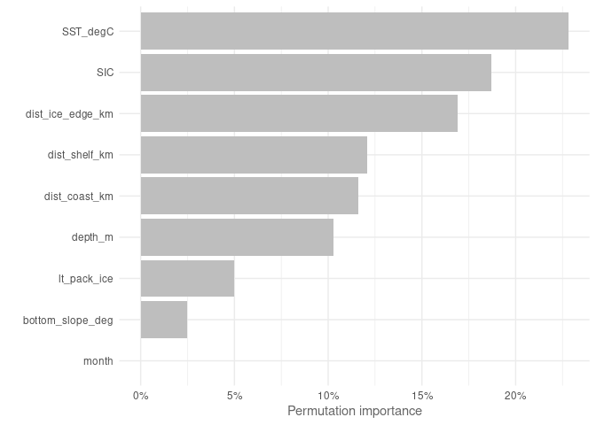
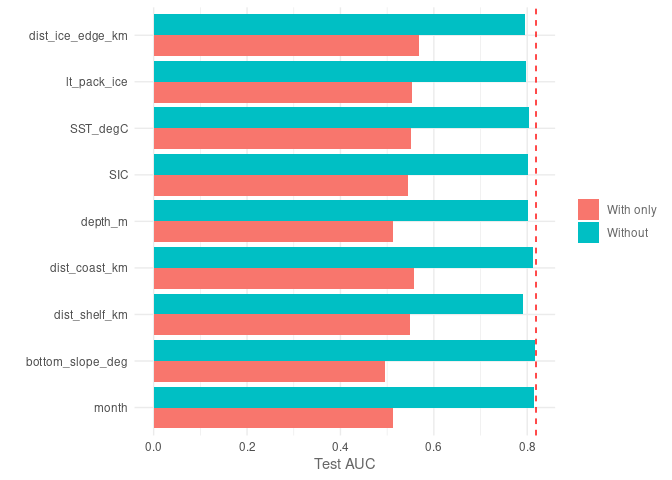
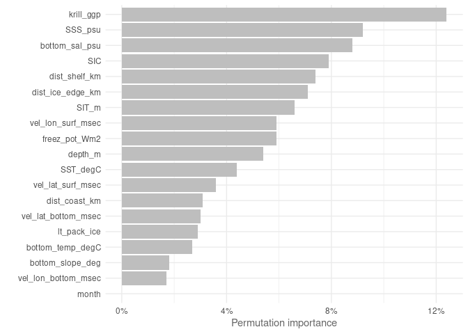
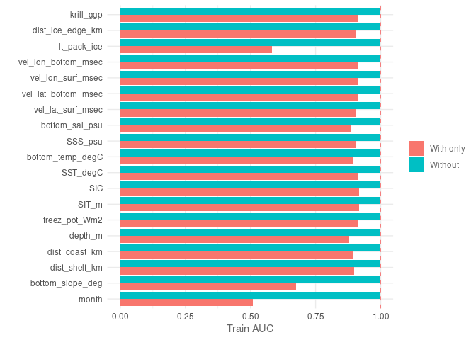
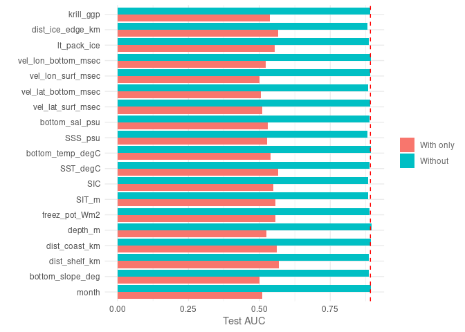
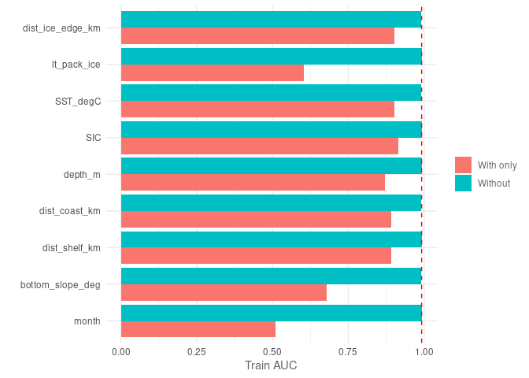
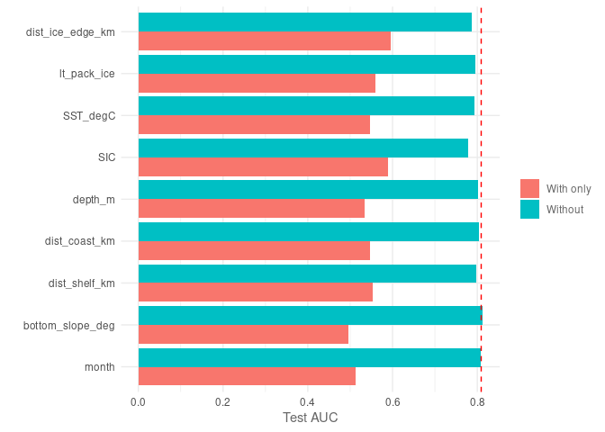
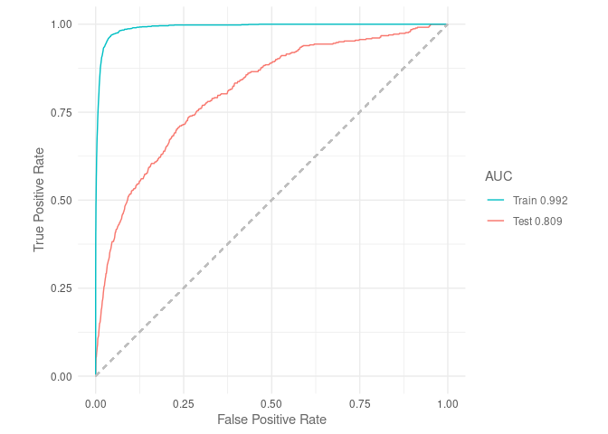

Gradient Boosted Trees
================
Denisse Fierro Arcos
2023-12-01

- <a href="#boosted-regression-trees-via-sdmtune"
  id="toc-boosted-regression-trees-via-sdmtune">Boosted Regression Trees
  via <code>SDMtune</code></a>
  - <a href="#loading-libraries" id="toc-loading-libraries">Loading
    libraries</a>
  - <a href="#setting-up-notebook" id="toc-setting-up-notebook">Setting up
    notebook</a>
  - <a href="#loading-mean-environmental-conditions-from-access-om2-01"
    id="toc-loading-mean-environmental-conditions-from-access-om2-01">Loading
    mean environmental conditions from ACCESS-OM2-01</a>
  - <a href="#loading-layers-for-plotting"
    id="toc-loading-layers-for-plotting">Loading layers for plotting</a>
  - <a
    href="#loading-environmental-data-from-access-om2-01-and-setting-up-variables"
    id="toc-loading-environmental-data-from-access-om2-01-and-setting-up-variables">Loading
    environmental data from ACCESS-OM2-01 and setting up variables</a>
  - <a href="#environmental-variables-matching-observations"
    id="toc-environmental-variables-matching-observations">Environmental
    variables matching observations</a>
    - <a href="#splitting-data-into-testing-and-training"
      id="toc-splitting-data-into-testing-and-training">Splitting data into
      testing and training</a>
  - <a href="#modelling" id="toc-modelling">Modelling</a>
  - <a href="#variable-importance" id="toc-variable-importance">Variable
    importance</a>
  - <a href="#jacknife-test" id="toc-jacknife-test">Jacknife test</a>
    - <a href="#plotting-jacknife-results"
      id="toc-plotting-jacknife-results">Plotting Jacknife results</a>
  - <a href="#roc-curves" id="toc-roc-curves">ROC curves</a>
  - <a href="#tss" id="toc-tss">TSS</a>
  - <a href="#simplifying-model" id="toc-simplifying-model">Simplifying
    model</a>
  - <a href="#model-report" id="toc-model-report">Model report</a>
  - <a href="#performance-metrics" id="toc-performance-metrics">Performance
    metrics</a>
  - <a href="#predictions" id="toc-predictions">Predictions</a>
    - <a href="#plotting-predictions" id="toc-plotting-predictions">Plotting
      predictions</a>
  - <a href="#access-om2-01---all-variables"
    id="toc-access-om2-01---all-variables">ACCESS-OM2-01 - All variables</a>
  - <a href="#training-brt-full-suite-of-access-om2-01-variables"
    id="toc-training-brt-full-suite-of-access-om2-01-variables">Training BRT
    (full suite of ACCESS-OM2-01 variables)</a>
  - <a href="#variable-importance-1" id="toc-variable-importance-1">Variable
    importance</a>
  - <a href="#jacknife-test-1" id="toc-jacknife-test-1">Jacknife test</a>
    - <a href="#plotting-jacknife-results-1"
      id="toc-plotting-jacknife-results-1">Plotting Jacknife results</a>
  - <a href="#roc-curves-1" id="toc-roc-curves-1">ROC curves</a>
  - <a href="#tss-1" id="toc-tss-1">TSS</a>
  - <a href="#simplifying-model-1" id="toc-simplifying-model-1">Simplifying
    model</a>
  - <a href="#model-report-1" id="toc-model-report-1">Model report</a>
  - <a href="#performance-metrics-1"
    id="toc-performance-metrics-1">Performance metrics</a>
  - <a href="#predictions-1" id="toc-predictions-1">Predictions</a>
    - <a href="#plotting-predictions-1"
      id="toc-plotting-predictions-1">Plotting predictions</a>
  - <a href="#observations-remotely-sensed-environmental-variables"
    id="toc-observations-remotely-sensed-environmental-variables">Observations
    (remotely sensed environmental variables)</a>
  - <a href="#training-brt-observations"
    id="toc-training-brt-observations">Training BRT (observations)</a>
  - <a href="#variable-importance-2" id="toc-variable-importance-2">Variable
    importance</a>
  - <a href="#jacknife-test-2" id="toc-jacknife-test-2">Jacknife test</a>
    - <a href="#plotting-jacknife-results-2"
      id="toc-plotting-jacknife-results-2">Plotting Jacknife results</a>
  - <a href="#roc-curves-2" id="toc-roc-curves-2">ROC curves</a>
  - <a href="#tss-2" id="toc-tss-2">TSS</a>
  - <a href="#model-report-2" id="toc-model-report-2">Model report</a>
  - <a href="#performance-metrics-2"
    id="toc-performance-metrics-2">Performance metrics</a>
  - <a href="#predictions-2" id="toc-predictions-2">Predictions</a>
    - <a href="#plotting-predictions-2"
      id="toc-plotting-predictions-2">Plotting predictions</a>

# Boosted Regression Trees via `SDMtune`

Boosted Regression Trees (BRTs) is a popular machine learning algorithm
across many areas of study, and it has become increasingly used by
ecologists to predict distribution of species. BRTs produce a large
number of simple trees, with each tree optimising the performance of the
previous one. A single simple tree will likely lead to a rather weak
performance, but when multiple trees are combined, they boost the
overall predictive performance of the model.

In this project, we will use Boosted Regression Trees as one of the
model algorithms used in our Species Distribution Model ensemble to
estimate the distribution of crabeater seals in the recent past.

## Loading libraries

``` r
library(tidyverse)
library(SDMtune)
library(gbm)
library(stars)
library(sf)
library(cmocean)
library(cowplot)
library(prg)
source("useful_functions.R")
```

## Setting up notebook

Selecting (or creating) an output folder for Random Forest results.

``` r
#Location of folder for outputs
out_folder <- "../../SDM_outputs/BoostedRegressionTrees/Mod_match_obs"
#If folder does not exist, create one
if(!dir.exists(out_folder)){
  dir.create(out_folder, recursive = T)
}

#Get path to files containing data
file_list <- list.files("../../Environmental_Data/", pattern = "Indian", full.names = T)
```

## Loading mean environmental conditions from ACCESS-OM2-01

This dataset includes the mean environmental conditions per month
(November and December) over the entire period of study (1981 to 2013).
Since Boosted Regression Trees are not affected my multicollinearity, we
will include all variables available in the model.

``` r
mean_model <- read_csv("../../Environmental_Data/ACCESS-OM2-01/All_values_month_ACCESS-OM2-01_env_vars.csv") %>% 
  mutate(month = as.factor(month))
```

    ## Rows: 730244 Columns: 21
    ## ── Column specification ────────────────────────────────────────────────────────
    ## Delimiter: ","
    ## dbl (21): yt_ocean, xt_ocean, bottom_slope_deg, dist_shelf_km, dist_coast_km...
    ## 
    ## ℹ Use `spec()` to retrieve the full column specification for this data.
    ## ℹ Specify the column types or set `show_col_types = FALSE` to quiet this message.

``` r
#List of categorical variables
cat_vars <- "month"

mean_model_baked <- prep_pred(mean_model, cat_vars)
```

## Loading layers for plotting

We will extract this layer from the `rnaturalearth` package. We will
then reproject this layer to South Polar Stereographic (`EPSG 3976`).

``` r
#Loading layer
antarctica <- rnaturalearth::ne_countries(continent = "Antarctica",
                                          returnclass = "sf") %>% 
  #Transforming to South Polar Stereographic
  st_transform(3976)
```

## Loading environmental data from ACCESS-OM2-01 and setting up variables

We will use the datasets created in the notebook
`02_Merging_background_presence_data.Rmd` located within the
`Scripts/05_SDMs` folder. These datasets include the crabeater seal
observations, background points, and environmental data.

We will also define categorical and continuous explanatory variables.

## Environmental variables matching observations

Since multicollinearity is not an issue for Random Forest, we will
include all ACCESS-OM2-01 outputs that match the environmental variables
available in observational datasets.

The variable `month` will be included as an ordinal factor in our
analysis.

``` r
#Loading data
mod_match_obs <- read_csv(str_subset(file_list, "match")) %>% 
  #Setting month as factor and ordered factor
  mutate(month = as.factor(month))
```

    ## Rows: 32368 Columns: 13
    ## ── Column specification ────────────────────────────────────────────────────────
    ## Delimiter: ","
    ## dbl (13): year, month, xt_ocean, yt_ocean, presence, bottom_slope_deg, dist_...
    ## 
    ## ℹ Use `spec()` to retrieve the full column specification for this data.
    ## ℹ Specify the column types or set `show_col_types = FALSE` to quiet this message.

### Splitting data into testing and training

The `prep_data` function in the `useful_functions` script will be used
to split our data and to apply all necessary transformations.

We will then transform the data into SWD (“samples with data”) format,
which is the required format for inputs used in the `SDMtune` library.

``` r
#Getting training data
mod_match_obs <- prep_data(mod_match_obs, cat_vars, split = F)

#Applying SWD format to model data
model_data <- mod_match_obs %>% 
  select(!year) %>% 
  sdm_format() %>% 
  trainValTest(test = 0.25, only_presence = F, seed = 42)
```

## Modelling

Boosted Regression Trees have five hyperparameters that can be adjusted
to improve model performance:  
1. `distribution` - Name of the distribution to use in the model. We
will use the default value: `bernoulli` as we have binary data.  
2. `n.trees` - Total number of trees to be used in an ensemble.  
3. `interaction.depth` - Maximum depth (i.e., maximum number of nodes or
branches) an individual tree can have.  
4. `shrinkage` - Commonly known as the *learning rate*. This determines
the contribution of each tree to the final outcome.  
5. `bag.fraction` - The proportion of data used in selecting variables
for tree expansion.

Here, we use the `optimizeModel` function from the `SDMtune` library to
test various values combinations for these hyperparameters, except
`distribution`, which we will leave as the deafult. The `optimizeModel`
function will a list of models tested ranked by their performance, so we
will keep the first model returned.

``` r
#Train model
default_model <- train(method = "BRT", data = model_data[[1]])

#Find number of predictors/features used
n_features <- ncol(model_data[[1]]@data)

# Define the hyperparameters to test
hyp_parm <- list(n.trees = seq(n_features*10, n_features*100, length.out = 10),
                 #maximum depth per tree
                 interaction.depth = 1:10,
                 #learning rate
                 shrinkage = c(1e-4, 1e-3, 1e-2, 0.1, 0.2, 0.3, 0.4, 0.5, 1),
                 bag.fraction = seq(0.25, 1, by = 0.25))

# Genetic algorithm that searches for best model parameters
optimised_model <- optimizeModel(default_model, hypers = hyp_parm, 
                                 metric = "auc", test = model_data[[2]], 
                                 seed = 42)

#We will keep the best performing models based on AUC
best_mod_match_obs <- optimised_model@models[[1]]

#Save model
best_mod_match_obs %>% 
  saveRDS(file.path(out_folder, "best_BRT_mod_match_obs.rds"))

#Check model parameters
best_mod_match_obs
```

## Variable importance

``` r
#Calculating importance
var_imp_mod_match_obs <- varImp(best_mod_match_obs)
```

    ## Variable importance  ■■■■                              11% | ETA: 28s - 00:00:3…Variable importance  ■■■■■■■■                          22% | ETA: 22s - 00:00:6…Variable importance  ■■■■■■■■■■■                       33% | ETA: 18s - 00:00:9…Variable importance  ■■■■■■■■■■■■■■                    44% | ETA: 15s - 00:00:12Variable importance  ■■■■■■■■■■■■■■■■■■                56% | ETA: 12s - 00:00:1…Variable importance  ■■■■■■■■■■■■■■■■■■■■■             67% | ETA:  9s - 00:00:1…Variable importance  ■■■■■■■■■■■■■■■■■■■■■■■■          78% | ETA:  6s - 00:00:2…Variable importance  ■■■■■■■■■■■■■■■■■■■■■■■■■■■■      89% | ETA:  3s - 00:00:2…Variable importance  ■■■■■■■■■■■■■■■■■■■■■■■■■■■■■■■  100% | ETA:  0s - 00:00:2…

``` r
#Plotting results
p <- plotVarImp(var_imp_mod_match_obs)
#Saving results
saveRDS(p, "../../SDM_outputs/BRT_var_imp_mod_match_obs.rds")
```

<!-- -->

`SST` and `SIC` are the two most important variables identified in the
model, similar to MaxEnt results. `month`, the slope of the seafloor
(`bottom_slope_deg`) and the long-term presence of pack ice
(`lt_pack_ice`) are the three least important variables, which coincides
with results from Random Forest and MaxEnt. We can check model
performance by plotting ROC curves and TSS value.

## Jacknife test

We can check which environment variable contributes the most/least to
the Boosted Regression Trees results when testing against the training
and testing datasets.

``` r
jk_mod_match_obs <- doJk(best_mod_match_obs, metric = "auc", 
                         test = model_data[[2]])
```

    ## Jk Test  ■■■                                6% | ETA:  3m - 00:00:12.2Jk Test  ■■■■                              11% | ETA:  2m - 00:00:13.4Jk Test  ■■■■■■                            17% | ETA:  2m - 00:00:25.5Jk Test  ■■■■■■■■                          22% | ETA:  2m - 00:00:28.4Jk Test  ■■■■■■■■■                         28% | ETA:  2m - 00:00:39.8Jk Test  ■■■■■■■■■■■                       33% | ETA:  1m - 00:00:43.2Jk Test  ■■■■■■■■■■■■■                     39% | ETA:  1m - 00:00:54.9Jk Test  ■■■■■■■■■■■■■■                    44% | ETA:  1m - 00:00:58.2Jk Test  ■■■■■■■■■■■■■■■■                  50% | ETA:  1m - 00:01:10.1Jk Test  ■■■■■■■■■■■■■■■■■■                56% | ETA:  1m - 00:01:13.4Jk Test  ■■■■■■■■■■■■■■■■■■■               61% | ETA:  1m - 00:01:24.9Jk Test  ■■■■■■■■■■■■■■■■■■■■■             67% | ETA: 44s - 00:01:28.2Jk Test  ■■■■■■■■■■■■■■■■■■■■■■■           72% | ETA: 38s - 00:01:39.8Jk Test  ■■■■■■■■■■■■■■■■■■■■■■■■          78% | ETA: 29s - 00:01:43.2Jk Test  ■■■■■■■■■■■■■■■■■■■■■■■■■■        83% | ETA: 23s - 00:01:55.3Jk Test  ■■■■■■■■■■■■■■■■■■■■■■■■■■■■      89% | ETA: 15s - 00:01:58.3Jk Test  ■■■■■■■■■■■■■■■■■■■■■■■■■■■■■     94% | ETA:  8s - 00:02:10.1Jk Test  ■■■■■■■■■■■■■■■■■■■■■■■■■■■■■■■  100% | ETA:  0s - 00:02:13.4

``` r
jk_mod_match_obs
```

    ##           Variable Train_AUC_without Train_AUC_withonly Test_AUC_without
    ## 1            month         0.9865240          0.5086796        0.8148104
    ## 2 bottom_slope_deg         0.9846409          0.6734391        0.8166759
    ## 3    dist_shelf_km         0.9854490          0.8702351        0.7916482
    ## 4    dist_coast_km         0.9861299          0.8622356        0.8116347
    ## 5          depth_m         0.9859542          0.8519098        0.8024009
    ## 6              SIC         0.9852764          0.8830957        0.8019318
    ## 7         SST_degC         0.9859905          0.8834606        0.8029648
    ## 8      lt_pack_ice         0.9875723          0.5814645        0.7970949
    ## 9 dist_ice_edge_km         0.9851827          0.8626062        0.7959484
    ##   Test_AUC_withonly
    ## 1         0.5117868
    ## 2         0.4947670
    ## 3         0.5486238
    ## 4         0.5579620
    ## 5         0.5118326
    ## 6         0.5448599
    ## 7         0.5514674
    ## 8         0.5524085
    ## 9         0.5676746

### Plotting Jacknife results

Results calculated from training dataset.

``` r
plotJk(jk_mod_match_obs, type = "train", ref = SDMtune::auc(best_mod_match_obs))
```

<!-- -->

The `month`, long-term presence of pack ice (`lt_pack_ice`) and the
slope of the seafloor (`bottom_slope_deg`) are the three variables that
contribute the least when used by themselves, which coincides with
results from the variable importance. On the other hand, `SIC`, `SST`,
distance to the sea ice edge (`dist_ice_edge_km`) and to the continental
shelf (`dist_shelf_km`) are the variables that contribute the most by
themselves. Results suggest that removing any of variables included in
the model will not negatively affect model performance, but we will
check if this is also true when the model is applied to a testing
dataset.

``` r
plotJk(jk_mod_match_obs, type = "test", 
       ref = SDMtune::auc(best_mod_match_obs, test = model_data[[2]]))
```

<!-- -->

The `month` and the slope of the seafloor (`bottom_slope_deg`) continue
to be the two variable that contribute the least to the model, and the
contribution of depth is also low. However, the difference in
contribution across variables now has a smaller difference between the
largest and smallest contributors. We can see that removing most
variables from the model, except `month` and `bottom_slope_deg`, would
negatively affect performance. We will calculate AUC and TSS values and
then test if it is possible to remove any variables without affecting
model performance to simplify the model.

## ROC curves

``` r
plotROC(best_mod_match_obs, test = model_data[[2]])
```

    ## Warning: The following aesthetics were dropped during statistical transformation: m and
    ## d.
    ## ℹ This can happen when ggplot fails to infer the correct grouping structure in
    ##   the data.
    ## ℹ Did you forget to specify a `group` aesthetic or to convert a numerical
    ##   variable into a factor?

<!-- -->

Based on AUC values, Boosted Regression Trees have a slightly lower
performance than Random Forests (test = 0.852), but it performs better
than the MaxEnt model, which had an AUC value of 0.65.

## TSS

This is a measure of predictive accuracy, which captures the proportion
of correctly classified cells as true absences (specificity) or true
presences (sensitivity). The TSS provides a normalised value of model
accuracy so that it can be compared to accuracy by chance alone.

TSS values between 0.4 and 0.7 indicate a good model performance. Below
this range, TSS indicates poor model performance, and above this range
are models with excellent performance.

``` r
tss(best_mod_match_obs)
```

    ## [1] 0.8929423

TSS suggests this model has excellent performance, TSS is about 2.5
times higher than the one obtained in MaxEnt, but once again, it is
lower than the results for Random Forests (0.99).

## Simplifying model

We will now check if we can remove the variables that contributed the
least to the model (5% or less). The code below will remove one variable
at a time, train the model and recalculate AUC. A variable will only be
removed if it has no negative effect on predictive performance (using
AUC).

``` r
reduced_model <- reduceVar(best_mod_match_obs, metric = "auc", 
                           test = model_data[[2]], th = 5, permut = 10, 
                           use_jk = T)
```

    ## ✔ No variables  have been removed

``` r
reduced_model
```

    ## 

    ## ── Object of class: <SDMmodel> ──

    ## 

    ## Method: Boosted Regression Trees

    ## 

    ## ── Hyperparameters

    ## • distribution: "bernoulli"

    ## • n.trees: 540

    ## • interaction.depth: 7

    ## • shrinkage: 0.2

    ## • bag.fraction: 1

    ## 

    ## ── Info

    ## • Species: Crabeater seals

    ## • Presence locations: 1381

    ## • Absence locations: 22895

    ## 

    ## ── Variables

    ## • Continuous: "bottom_slope_deg", "dist_shelf_km", "dist_coast_km", "depth_m",
    ## "SIC", "SST_degC", "lt_pack_ice", and "dist_ice_edge_km"

    ## • Categorical: "month"

No variables can be removed without compromising model performance. We
will produce a final report for our model and finally predict crabeater
distribution.

## Model report

Before moving onto testing a new model, we will save a report with the
information shown above.

``` r
modelReport(best_mod_match_obs, folder = out_folder, test = model_data[[2]], 
            response_curves = T, only_presence = T, jk = T)
```

## Performance metrics

To be able to compare the performance of this model with the three other
SDM algorithms to be used in the SDM ensemble, we will calculate three
metrics: area under the receiver operating curve ($AUC_{ROC}$), area
under the precisison-recall gain curve ($AUC_{PRG}$) and the Pearson
correlation between the model predictions and the testing dataset.

``` r
#Predicting values using testing dataset
pred <- predict(best_mod_match_obs, model_data[[2]]@data, type = "response")

#AUC ROC
auc_roc <- SDMtune::auc(best_mod_match_obs, model_data[[2]])

#AUC PRG
auc_prg <- create_prg_curve(model_data[[2]]@pa, pred) %>% 
  calc_auprg()

#Pearson correlation
cor <- cor(pred, model_data[[2]]@pa)

print(c(paste0("AUC ROC: ", round(auc_roc, 3)),
        paste0("AUC PRG: ", round(auc_prg, 3)),
        paste0("Pearson correlation: ", round(cor, 3))))
```

    ## [1] "AUC ROC: 0.819"             "AUC PRG: 0.833"            
    ## [3] "Pearson correlation: 0.257"

Saving model evaluation results.

``` r
#Load model evaluation data frame and add results
model_eval_path <- "../../SDM_outputs/model_evaluation.csv"
read_csv(model_eval_path) %>% 
  bind_rows(data.frame(model = "BoostedRegressionTrees", 
                       env_trained = "mod_match_obs", auc_roc = auc_roc, 
                       auc_prg = auc_prg, pear_cor = cor)) %>% 
  write_csv(model_eval_path)
```

## Predictions

We will use the reduced model to predict crabeater seals distribution.

``` r
pred_mod_match_obs <- mean_model_baked %>% 
  drop_na() %>% 
  mutate(pred = as.vector(predict(reduced_model,
                                  data = drop_na(mean_model_baked),
                                  type = "response")))

pred_mod_match_obs_ras <- pred_mod_match_obs %>% 
  #Select relevant variables only
  select(xt_ocean, yt_ocean, pred, month) %>% 
  right_join(mean_model_baked %>%
  #Select relevant variables only
  select(xt_ocean, yt_ocean, month)) %>% 
  #Set dimensions
  st_as_stars(dims = c("xt_ocean", "yt_ocean", "month")) %>% 
  #Ensuring month dimension is shown correctly
  st_set_dimensions("month", values = c(11, 12)) %>%
  #Set CRS
  st_set_crs(4326) %>% 
  #Transform to South Pole stereographic
  st_transform(crs = st_crs(3976))
```

    ## Joining with `by = join_by(xt_ocean, yt_ocean, month)`

``` r
#Saving outputs
#Data frame
pred_mod_match_obs %>% 
  write_csv(file.path(out_folder, "mean_pred_match_obs.csv"))
#Saving as R dataset so it can be easily open with readRDS
saveRDS(pred_mod_match_obs_ras,
        file.path(out_folder, "mean_pred_match_obs_raster.rds"))
```

### Plotting predictions

``` r
#Plotting November distribution
#Prepping data
nov <- pred_mod_match_obs_ras %>% 
  slice(index = 1, along = "month") 

#Plotting
nov_plot <- ggplot()+
  geom_stars(data = nov)+
  geom_sf(data = antarctica)+
  lims(x = c(0, 4000000))+
  #Set colour palette
  scale_fill_cmocean(name = "haline", direction = -1, 
                     guide = guide_colorbar(barwidth = 1, barheight = 10, 
                                            ticks = FALSE, nbin = 1000, 
                                            frame.colour = "black"), 
                     limits = c(0, 1)) +
  theme_linedraw() +
  theme(panel.background = element_blank(),
        panel.grid.major = element_blank(),
        panel.grid.minor = element_blank(), 
        legend.position = "none",
        plot.title = element_text(hjust = 0.5)) +
  labs(title = "November",
       x = "Longitude",
       y = "Latitude")

dec <- pred_mod_match_obs_ras %>% 
  slice(index = 2, along = "month") 

dec_plot <- ggplot() +
  geom_stars(data = dec) +
  geom_sf(data = antarctica)+
  lims(x = c(0, 4000000))+
  scale_fill_cmocean(name = "haline", direction = -1, 
                     guide = guide_colorbar(barwidth = 1, barheight = 10, 
                                            ticks = FALSE, nbin = 1000, 
                                            frame.colour = "black"), 
                     limits = c(0, 1)) +
  theme_linedraw() +
  theme(panel.background = element_blank(),
        panel.grid.major = element_blank(),
        panel.grid.minor = element_blank(), 
        plot.title = element_text(hjust = 0.5)) +
  labs(title = "December",
       x = "Longitude",
       y = " ",
       fill = "Probability")

#Get legend
legend <- get_legend(dec_plot)

#Remove legend from December plot
dec_plot <- dec_plot + theme(legend.position = "none")

#Plotting together
plot_match_obs <- plot_grid(nov_plot, dec_plot, legend, ncol = 3, nrow = 1,
                            rel_widths = c(1, 1, 0.3))

#Add title
title <- ggdraw()+
  draw_label("Mean crabeater seal distribution\n(ACCESS-OM2-01 - simplified)",
             fontface = "bold", hjust = 0.5)+
  theme(plot.margin = ggplot2::margin(0, 0, 0, 0))

#Putting everything together
final <- plot_grid(title, plot_match_obs, ncol = 1, rel_heights = c(0.1, 1))

#Saving graph
ggsave(file.path(out_folder, "map_mean_pred_match_obs.png"), plot = final, 
       device = "png", bg = "white", width = 8.75, height = 7)
```

## ACCESS-OM2-01 - All variables

We will set up the output folder and load the ACCESS-OM2-01 data. Since
BRTs are not affected by multicollinearity, we will use all variables
available.

``` r
#Location of folder for outputs
out_folder <- "../../SDM_outputs/BoostedRegressionTrees/Mod_full"
#If folder does not exist, create one
if(!dir.exists(out_folder)){
  dir.create(out_folder, recursive = T)
}

#Loading data
mod_data <- read_csv(str_subset(file_list, "model")) %>% 
  select(!krill_growth_rate) %>% 
  #Setting month as factor and ordered factor
  mutate(month = as.factor(month))
```

    ## Rows: 32368 Columns: 24
    ## ── Column specification ────────────────────────────────────────────────────────
    ## Delimiter: ","
    ## dbl (24): year, month, xt_ocean, yt_ocean, presence, bottom_slope_deg, dist_...
    ## 
    ## ℹ Use `spec()` to retrieve the full column specification for this data.
    ## ℹ Specify the column types or set `show_col_types = FALSE` to quiet this message.

``` r
# Splitting into testing and training
mod <- prep_data(mod_data, cat_vars, split = F)

#Applying SWD format to model data
model_data <- mod %>% 
  select(!year) %>% 
  drop_na(krill_ggp) %>% 
  sdm_format() %>% 
  trainValTest(test = 0.25, only_presence = T, seed = 42)
```

## Training BRT (full suite of ACCESS-OM2-01 variables)

``` r
#Train model
default_model <- train(method = "BRT", data = model_data[[1]])

#Find number of predictors/features used
n_features <- ncol(model_data[[1]]@data)

# Define the hyperparameters to test
hyp_parm <- list(n.trees = seq(n_features*10, n_features*100, length.out = 10),
                 #maximum depth per tree
                 interaction.depth = 1:10,
                 #learning rate
                 shrinkage = c(1e-4, 1e-3, 1e-2, 0.1, 0.2, 0.3, 0.4, 0.5, 1),
                 bag.fraction = seq(0.25, 1, by = 0.25))

# Genetic algorithm that searches for best model parameters
optimised_model <- optimizeModel(default_model, hypers = hyp_parm, 
                                 metric = "auc", test = model_data[[2]], 
                                 seed = 42)

#We will keep the best performing models based on AUC
best_mod <- optimised_model@models[[1]]

#Save model
best_mod %>% 
  saveRDS(file.path(out_folder, "best_BRT_ACCESS.rds"))

#Check model parameters
best_mod
```

    ## 

    ## ── Object of class: <SDMmodel> ──

    ## 

    ## Method: Boosted Regression Trees

    ## 

    ## ── Hyperparameters

    ## • distribution: "bernoulli"

    ## • n.trees: 1140

    ## • interaction.depth: 10

    ## • shrinkage: 0.1

    ## • bag.fraction: 0.75

    ## 

    ## ── Info

    ## • Species: Crabeater seals

    ## • Presence locations: 1381

    ## • Absence locations: 30525

    ## 

    ## ── Variables

    ## • Continuous: "bottom_slope_deg", "dist_shelf_km", "dist_coast_km", "depth_m",
    ## "freez_pot_Wm2", "SIT_m", "SIC", "SST_degC", "bottom_temp_degC", "SSS_psu",
    ## "bottom_sal_psu", "vel_lat_surf_msec", "vel_lat_bottom_msec",
    ## "vel_lon_surf_msec", "vel_lon_bottom_msec", "lt_pack_ice", "dist_ice_edge_km",
    ## and "krill_ggp"

    ## • Categorical: "month"

## Variable importance

``` r
#Calculating importance
var_imp_mod <- varImp(best_mod)
```

    ## Variable importance  ■■■                                5% | ETA:  3m - 00:00:9…Variable importance  ■■■■                              11% | ETA:  3m - 00:00:19Variable importance  ■■■■■■                            16% | ETA:  2m - 00:00:2…Variable importance  ■■■■■■■                           21% | ETA:  2m - 00:00:3…Variable importance  ■■■■■■■■■                         26% | ETA:  2m - 00:00:4…Variable importance  ■■■■■■■■■■                        32% | ETA:  2m - 00:00:5…Variable importance  ■■■■■■■■■■■■                      37% | ETA:  2m - 00:01:3…Variable importance  ■■■■■■■■■■■■■■                    42% | ETA:  2m - 00:01:1…Variable importance  ■■■■■■■■■■■■■■■                   47% | ETA:  1m - 00:01:2…Variable importance  ■■■■■■■■■■■■■■■■■                 53% | ETA:  1m - 00:01:2…Variable importance  ■■■■■■■■■■■■■■■■■■                58% | ETA:  1m - 00:01:3…Variable importance  ■■■■■■■■■■■■■■■■■■■■              63% | ETA:  1m - 00:01:4…Variable importance  ■■■■■■■■■■■■■■■■■■■■■■            68% | ETA:  1m - 00:01:56Variable importance  ■■■■■■■■■■■■■■■■■■■■■■■           74% | ETA: 45s - 00:02:4…Variable importance  ■■■■■■■■■■■■■■■■■■■■■■■■■         79% | ETA: 36s - 00:02:1…Variable importance  ■■■■■■■■■■■■■■■■■■■■■■■■■■        84% | ETA: 27s - 00:02:22Variable importance  ■■■■■■■■■■■■■■■■■■■■■■■■■■■■      89% | ETA: 18s - 00:02:3…Variable importance  ■■■■■■■■■■■■■■■■■■■■■■■■■■■■■     95% | ETA:  9s - 00:02:3…Variable importance  ■■■■■■■■■■■■■■■■■■■■■■■■■■■■■■■  100% | ETA:  0s - 00:02:4…

``` r
#Plotting results
p <- plotVarImp(var_imp_mod)
#Saving results
saveRDS(p, "../../SDM_outputs/BRT_var_imp_mod_full.rds")
```

<!-- -->

Krill habitat (`krill_ggp`) was the most influential variable for this
model, `SIC` was among the top four, while `SST` had a relative low
contribution ($< 5 \%$). Once again, `month` did not contribute at all
to model performance. Next, we will check performance by plotting ROC
curves and TSS value.

## Jacknife test

We can check which environment variable contributes the most/least to
the BRT results when testing against the training and testing datasets.

``` r
jk_mod <- doJk(best_mod, metric = "auc", test = model_data[[2]])
```

    ## Jk Test  ■■                                 3% | ETA: 47m - 00:01:15.7Jk Test  ■■■                                5% | ETA: 24m - 00:01:19.9Jk Test  ■■■                                8% | ETA: 30m - 00:02:32.6Jk Test  ■■■■                              11% | ETA: 23m - 00:02:42.1Jk Test  ■■■■■                             13% | ETA: 26m - 00:03:55.1Jk Test  ■■■■■■                            16% | ETA: 22m - 00:04:4.1 Jk Test  ■■■■■■■                           18% | ETA: 23m - 00:05:17.2Jk Test  ■■■■■■■                           21% | ETA: 20m - 00:05:26.5Jk Test  ■■■■■■■■                          24% | ETA: 21m - 00:06:37.8Jk Test  ■■■■■■■■■                         26% | ETA: 19m - 00:06:46.9Jk Test  ■■■■■■■■■■                        29% | ETA: 20m - 00:07:58.9Jk Test  ■■■■■■■■■■                        32% | ETA: 18m - 00:08:8.4 Jk Test  ■■■■■■■■■■■                       34% | ETA: 18m - 00:09:32.3Jk Test  ■■■■■■■■■■■■                      37% | ETA: 17m - 00:09:42.2Jk Test  ■■■■■■■■■■■■■                     39% | ETA: 17m - 00:10:55.1Jk Test  ■■■■■■■■■■■■■■                    42% | ETA: 15m - 00:11:4.9 Jk Test  ■■■■■■■■■■■■■■                    45% | ETA: 15m - 00:12:16.8Jk Test  ■■■■■■■■■■■■■■■                   47% | ETA: 14m - 00:12:26.6Jk Test  ■■■■■■■■■■■■■■■■                  50% | ETA: 14m - 00:13:39.7Jk Test  ■■■■■■■■■■■■■■■■■                 53% | ETA: 12m - 00:13:49.3Jk Test  ■■■■■■■■■■■■■■■■■■                55% | ETA: 12m - 00:15:1.7 Jk Test  ■■■■■■■■■■■■■■■■■■                58% | ETA: 11m - 00:15:12 Jk Test  ■■■■■■■■■■■■■■■■■■■               61% | ETA: 11m - 00:16:24.6Jk Test  ■■■■■■■■■■■■■■■■■■■■              63% | ETA: 10m - 00:16:34.1Jk Test  ■■■■■■■■■■■■■■■■■■■■■             66% | ETA:  9m - 00:17:49.1Jk Test  ■■■■■■■■■■■■■■■■■■■■■■            68% | ETA:  8m - 00:17:59.8Jk Test  ■■■■■■■■■■■■■■■■■■■■■■            71% | ETA:  8m - 00:19:11.6Jk Test  ■■■■■■■■■■■■■■■■■■■■■■■           74% | ETA:  7m - 00:19:22.4Jk Test  ■■■■■■■■■■■■■■■■■■■■■■■■          76% | ETA:  6m - 00:20:35.1Jk Test  ■■■■■■■■■■■■■■■■■■■■■■■■■         79% | ETA:  6m - 00:20:45.3Jk Test  ■■■■■■■■■■■■■■■■■■■■■■■■■         82% | ETA:  5m - 00:21:57.4Jk Test  ■■■■■■■■■■■■■■■■■■■■■■■■■■        84% | ETA:  4m - 00:22:7.7 Jk Test  ■■■■■■■■■■■■■■■■■■■■■■■■■■■       87% | ETA:  4m - 00:23:22 Jk Test  ■■■■■■■■■■■■■■■■■■■■■■■■■■■■      89% | ETA:  3m - 00:23:30.8Jk Test  ■■■■■■■■■■■■■■■■■■■■■■■■■■■■■     92% | ETA:  2m - 00:24:43.8Jk Test  ■■■■■■■■■■■■■■■■■■■■■■■■■■■■■     95% | ETA:  1m - 00:24:53.5Jk Test  ■■■■■■■■■■■■■■■■■■■■■■■■■■■■■■    97% | ETA: 42s - 00:26:5.7 Jk Test  ■■■■■■■■■■■■■■■■■■■■■■■■■■■■■■■  100% | ETA:  0s - 00:26:15.5

``` r
jk_mod
```

    ##               Variable Train_AUC_without Train_AUC_withonly Test_AUC_without
    ## 1                month         0.9978949          0.5091231        0.8922382
    ## 2     bottom_slope_deg         0.9978259          0.6758008        0.8869357
    ## 3        dist_shelf_km         0.9978739          0.8986395        0.8869791
    ## 4        dist_coast_km         0.9979758          0.8959316        0.8938637
    ## 5              depth_m         0.9980189          0.8785227        0.8950132
    ## 6        freez_pot_Wm2         0.9979691          0.9138699        0.8882269
    ## 7                SIT_m         0.9978923          0.9156774        0.8829406
    ## 8                  SIC         0.9978803          0.9182513        0.8822087
    ## 9             SST_degC         0.9979207          0.9121030        0.8885580
    ## 10    bottom_temp_degC         0.9979397          0.8923368        0.8925997
    ## 11             SSS_psu         0.9979160          0.9069693        0.8808424
    ## 12      bottom_sal_psu         0.9979216          0.8861452        0.8891838
    ## 13   vel_lat_surf_msec         0.9978656          0.9051619        0.8916099
    ## 14 vel_lat_bottom_msec         0.9978612          0.9123738        0.8843997
    ## 15   vel_lon_surf_msec         0.9978912          0.9135132        0.8906459
    ## 16 vel_lon_bottom_msec         0.9979149          0.9145553        0.8935008
    ## 17         lt_pack_ice         0.9979535          0.5816575        0.8863430
    ## 18    dist_ice_edge_km         0.9979747          0.9035590        0.8813382
    ## 19           krill_ggp         0.9978452          0.9114325        0.8903985
    ##    Test_AUC_withonly
    ## 1          0.5104887
    ## 2          0.4996963
    ## 3          0.5679805
    ## 4          0.5602080
    ## 5          0.5241178
    ## 6          0.5557864
    ## 7          0.5554592
    ## 8          0.5492594
    ## 9          0.5658859
    ## 10         0.5385542
    ## 11         0.5270037
    ## 12         0.5298045
    ## 13         0.5107011
    ## 14         0.5041394
    ## 15         0.5003973
    ## 16         0.5211211
    ## 17         0.5532401
    ## 18         0.5650833
    ## 19         0.5373342

### Plotting Jacknife results

Results calculated from training dataset.

``` r
plotJk(jk_mod, type = "train", ref = SDMtune::auc(best_mod))
```

<!-- -->

The `month`, long-term presence of pack ice (`lt_pack_ice`) and the
slope of the seafloor (`bottom_slope_deg`) are once again the three
variables that contribute the least when used on their own, which
coincides with results from the model trained with the reduced
environmental variables above. However, they contribute at least to half
of the model performance, so we may not be able to exclude them to
simplify this model. We can now check results from the testing dataset.

``` r
plotJk(jk_mod, type = "test", ref = SDMtune::auc(best_mod, 
                                                 test = model_data[[2]]))
```

<!-- -->

Results from the testing dataset show that most variables contribute to
model performance in a similar proportion. It appears that the exclusion
of any of these variables will not significantly impact model
performance, so we will test if it is possible to simplify the model.
However, we may need to check the outputs of the simplify models as all
variables contribute to at least half of the model performance when used
on their own.

## ROC curves

``` r
plotROC(best_mod, test = model_data[[2]])
```

    ## Warning: The following aesthetics were dropped during statistical transformation: m and
    ## d.
    ## ℹ This can happen when ggplot fails to infer the correct grouping structure in
    ##   the data.
    ## ℹ Did you forget to specify a `group` aesthetic or to convert a numerical
    ##   variable into a factor?

<!-- -->

Based on AUC values, BRT is the best performing SDM algorithm.

## TSS

This is a measure of predictive accuracy, which captures the proportion
of correctly classified cells as true absences (specificity) or true
presences (sensitivity). The TSS provides a normalised value of model
accuracy so that it can be compared to accuracy by chance alone.

TSS values between 0.4 and 0.7 indicate a good model performance. Below
this range, TSS indicates poor model performance, and above this range
are models with excellent performance.

``` r
tss(best_mod)
```

    ## [1] 0.9791906

TSS is more than double than the one obtained in MaxEnt (0.43), but
slightly lower than Random Forest (0.982). This result suggests this
model has an excellent performance.

## Simplifying model

We will now check if we can remove the variables that contributed the
least to the model (5% or less). The code below will remove one variable
at a time, train the model and recalculate AUC. A variable will only be
removed if it has no negative effect on predictive performance (using
AUC).

``` r
reduced_model <- reduceVar(best_mod, metric = "auc", test = model_data[[2]],
                          th = 5, permut = 10, use_jk = T)
```

    ## ✔ The variables month, bottom_slope_deg, vel_lon_bottom_msec, depth_m, vel_lat_surf_msec, vel_lat_bottom_msec, lt_pack_ice, and bottom_temp_degC have been removed

``` r
reduced_model
```

    ## 

    ## ── Object of class: <SDMmodel> ──

    ## 

    ## Method: Boosted Regression Trees

    ## 

    ## ── Hyperparameters

    ## • distribution: "bernoulli"

    ## • n.trees: 1140

    ## • interaction.depth: 10

    ## • shrinkage: 0.1

    ## • bag.fraction: 0.75

    ## 

    ## ── Info

    ## • Species: Crabeater seals

    ## • Presence locations: 1381

    ## • Absence locations: 30525

    ## 

    ## ── Variables

    ## • Continuous: "dist_shelf_km", "dist_coast_km", "freez_pot_Wm2", "SIT_m",
    ## "SIC", "SST_degC", "SSS_psu", "bottom_sal_psu", "vel_lon_surf_msec",
    ## "dist_ice_edge_km", and "krill_ggp"

    ## • Categorical: NA

In total, eight variables were deemed to be redundant, including: bottom
velocity of the water along longitudes (`vel_lon_bottom_msec`) and water
velocity along latitudes (`vel_lat_bottom_msec` and
`vel_lat_surf_msec`), the slope of the seafloor (`bottom_slope_deg`),
`month`, long-term presence of sea ice (`lt_pack_ice`), water
temperature near the seafloor (`bottom_temp_degC`), and depth
(`depth_m`). We will check that the AUC and TSS are similar to the full
model before moving onto creating predictions.

``` r
print(c(paste0("AUC: ", SDMtune::auc(reduced_model)),
        paste0("TSS: ", tss(reduced_model))))
```

    ## [1] "AUC: 0.997192968098109" "TSS: 0.971916705066596"

Although the performance metrics are similar to those from the full
model, we will use the full model instead because the predictions
obtained with the simplified model were largely zero.

## Model report

Before moving onto testing a new model, we will save a report with the
information shown above.

``` r
modelReport(best_mod, folder = out_folder, test = model_data[[2]], 
            response_curves = T, only_presence = T, jk = T)
```

## Performance metrics

To be able to compare the performance of this model with the three other
SDM algorithms to be used in the SDM ensemble, we will calculate three
metrics: area under the receiver operating curve ($AUC_{ROC}$), area
under the precisison-recall gain curve ($AUC_{PRG}$) and the Pearson
correlation between the model predictions and the testing dataset.

``` r
#Predicting values using testing dataset
pred <- predict(best_mod, model_data[[2]]@data, type = "response")

#AUC ROC
auc_roc <- SDMtune::auc(best_mod, model_data[[2]])

#AUC PRG
auc_prg <- create_prg_curve(model_data[[2]]@pa, pred) %>% 
  calc_auprg()

#Pearson correlation
cor <- cor(pred, model_data[[2]]@pa)

print(c(paste0("AUC ROC: ", round(auc_roc, 3)),
        paste0("AUC PRG: ", round(auc_prg, 3)),
        paste0("Pearson correlation: ", round(cor, 3))))
```

    ## [1] "AUC ROC: 0.891"            "AUC PRG: 0.979"           
    ## [3] "Pearson correlation: 0.26"

Saving model evaluation results.

``` r
#Load model evaluation data frame and add results
read_csv(model_eval_path) %>% 
  bind_rows(data.frame(model = "BoostedRegressionTrees", 
                       env_trained = "full_access", auc_roc = auc_roc, 
                       auc_prg = auc_prg, pear_cor = cor)) %>% 
  write_csv(model_eval_path)
```

## Predictions

We will use the reduced model to predict crabeater seals distribution.

``` r
pred_mod <- mean_model_baked %>% 
  drop_na() %>% 
  mutate(pred = as.vector(predict(best_mod,
                                  data = drop_na(mean_model_baked),
                                  type = "response")))

pred_mod_ras <- pred_mod %>% 
  #Select relevant variables only
  select(xt_ocean, yt_ocean, pred, month) %>% 
  right_join(mean_model_baked %>%
  #Select relevant variables only
  select(xt_ocean, yt_ocean, month)) %>% 
  #Set dimensions
  st_as_stars(dims = c("xt_ocean", "yt_ocean", "month")) %>% 
  #Ensuring month dimension is shown correctly
  st_set_dimensions("month", values = c(11, 12)) %>%
  #Set CRS
  st_set_crs(4326) %>% 
  #Transform to South Pole stereographic
  st_transform(crs = st_crs(3976))
```

    ## Joining with `by = join_by(xt_ocean, yt_ocean, month)`

``` r
#Saving outputs
#Data frame
pred_mod %>% 
  write_csv(file.path(out_folder, "mean_pred_ACCESS.csv"))
#Saving as R dataset so it can be easily open with readRDS
saveRDS(pred_mod_ras,
        file.path(out_folder, "mean_pred_ACCESS_raster.rds"))
```

### Plotting predictions

``` r
#Plotting November distribution
#Prepping data
nov <- pred_mod_ras %>% 
  slice(index = 1, along = "month") 

#Plotting
nov_plot <- ggplot()+
  geom_stars(data = nov)+
  geom_sf(data = antarctica)+
  lims(x = c(0, 4000000))+
  #Set colour palette
  scale_fill_cmocean(name = "haline", direction = -1, 
                     guide = guide_colorbar(barwidth = 1, barheight = 10, 
                                            ticks = FALSE, nbin = 1000, 
                                            frame.colour = "black"), 
                     limits = c(0, 1)) +
  theme_linedraw() +
  theme(panel.background = element_blank(),
        panel.grid.major = element_blank(),
        panel.grid.minor = element_blank(), 
        legend.position = "none",
        plot.title = element_text(hjust = 0.5)) +
  labs(title = "November",
       x = "Longitude",
       y = "Latitude")

dec <- pred_mod_ras %>% 
  slice(index = 2, along = "month") 

dec_plot <- ggplot() +
  geom_stars(data = dec) +
  geom_sf(data = antarctica)+
  lims(x = c(0, 4000000))+
  scale_fill_cmocean(name = "haline", direction = -1, 
                     guide = guide_colorbar(barwidth = 1, barheight = 10, 
                                            ticks = FALSE, nbin = 1000, 
                                            frame.colour = "black"), 
                     limits = c(0, 1)) +
  theme_linedraw() +
  theme(panel.background = element_blank(),
        panel.grid.major = element_blank(),
        panel.grid.minor = element_blank(), 
        plot.title = element_text(hjust = 0.5)) +
  labs(title = "December",
       x = "Longitude",
       y = " ",
       fill = "Probability")

#Get legend
legend <- get_legend(dec_plot)

#Remove legend from December plot
dec_plot <- dec_plot + theme(legend.position = "none")

#Plotting together
plot_match_obs <- plot_grid(nov_plot, dec_plot, legend, ncol = 3, nrow = 1,
                            rel_widths = c(1, 1, 0.3))

#Add title
title <- ggdraw()+
  draw_label("Mean crabeater seal distribution\n(ACCESS-OM2-01)",
             fontface = "bold", hjust = 0.5)+
  theme(plot.margin = ggplot2::margin(0, 0, 0, 0))

#Putting everything together
final <- plot_grid(title, plot_match_obs, ncol = 1, rel_heights = c(0.1, 1))

#Saving graph
ggsave(file.path(out_folder, "map_mean_pred_ACCESS.png"), plot = final, 
       device = "png", bg = "white", width = 8.75, height = 7)
```

## Observations (remotely sensed environmental variables)

We will set up a new output folder and load the remotely sensed
environmental data. Since BRT are not affected by multicollinearity, we
will use all variables available.

``` r
#Location of folder for outputs
out_folder <- "../../SDM_outputs/BoostedRegressionTrees/Obs"
#If folder does not exist, create one
if(!dir.exists(out_folder)){
  dir.create(out_folder, recursive = T)
}

#Loading mean environmental conditions from observations
mean_obs <- read_csv("../../Environmental_Data/Env_obs/All_values_month_Obs_env_vars.csv") %>% 
  mutate(month = as.factor(month))
```

    ## Rows: 730244 Columns: 11
    ## ── Column specification ────────────────────────────────────────────────────────
    ## Delimiter: ","
    ## dbl (11): yt_ocean, xt_ocean, bottom_slope_deg, dist_shelf_km, dist_coast_km...
    ## 
    ## ℹ Use `spec()` to retrieve the full column specification for this data.
    ## ℹ Specify the column types or set `show_col_types = FALSE` to quiet this message.

``` r
#Preparing data to be used for prediction
mean_obs_baked <- prep_pred(mean_obs, "month")

#Loading data
obs_data <- read_csv(str_subset(file_list, "/obs")) %>% 
  #Setting month as factor and ordered factor
  mutate(month = as.factor(month))
```

    ## Rows: 32033 Columns: 13
    ## ── Column specification ────────────────────────────────────────────────────────
    ## Delimiter: ","
    ## dbl (13): year, month, xt_ocean, yt_ocean, presence, bottom_slope_deg, dist_...
    ## 
    ## ℹ Use `spec()` to retrieve the full column specification for this data.
    ## ℹ Specify the column types or set `show_col_types = FALSE` to quiet this message.

``` r
# Splitting into testing and training
obs_data <- prep_data(obs_data, cat_vars, split = F)

#Applying SWD format to model data
model_data <- obs_data %>% 
  select(!year) %>% 
  sdm_format() %>% 
  trainValTest(test = 0.25, only_presence = T, seed = 42)
```

## Training BRT (observations)

``` r
#Train model
default_model <- train(method = "BRT", data = model_data[[1]])

#Find number of predictors/features used
n_features <- ncol(model_data[[1]]@data)

# Define the hyperparameters to test
hyp_parm <- list(n.trees = seq(n_features*10, n_features*100, length.out = 10),
                 #maximum depth per tree
                 interaction.depth = 1:10,
                 #learning rate
                 shrinkage = c(1e-4, 1e-3, 1e-2, 0.1, 0.2, 0.3, 0.4, 0.5, 1),
                 bag.fraction = seq(0.25, 1, by = 0.25))

# Genetic algorithm that searches for best model parameters
optimised_model <- optimizeModel(default_model, hypers = hyp_parm, 
                                 metric = "auc", test = model_data[[2]], 
                                 seed = 42)

#We will keep the best performing models based on AUC
best_obs <- optimised_model@models[[1]]

#Save model
best_obs %>% 
  saveRDS(file.path(out_folder, "best_BRT_obs.rds"))

#Check model parameters
best_obs
```

    ## 

    ## ── Object of class: <SDMmodel> ──

    ## 

    ## Method: Boosted Regression Trees

    ## 

    ## ── Hyperparameters

    ## • distribution: "bernoulli"

    ## • n.trees: 900

    ## • interaction.depth: 10

    ## • shrinkage: 0.1

    ## • bag.fraction: 1

    ## 

    ## ── Info

    ## • Species: Crabeater seals

    ## • Presence locations: 1380

    ## • Absence locations: 30193

    ## 

    ## ── Variables

    ## • Continuous: "bottom_slope_deg", "dist_shelf_km", "dist_coast_km", "depth_m",
    ## "SIC", "SST_degC", "lt_pack_ice", and "dist_ice_edge_km"

    ## • Categorical: "month"

## Variable importance

``` r
#Calculating importance
var_imp_obs <- varImp(best_obs)
```

    ## Variable importance  ■■■■                              11% | ETA:  1m - 00:00:6…Variable importance  ■■■■■■■■                          22% | ETA: 46s - 00:00:13Variable importance  ■■■■■■■■■■■                       33% | ETA: 39s - 00:00:1…Variable importance  ■■■■■■■■■■■■■■                    44% | ETA: 32s - 00:00:2…Variable importance  ■■■■■■■■■■■■■■■■■■                56% | ETA: 25s - 00:00:3…Variable importance  ■■■■■■■■■■■■■■■■■■■■■             67% | ETA: 19s - 00:00:38Variable importance  ■■■■■■■■■■■■■■■■■■■■■■■■          78% | ETA: 13s - 00:00:4…Variable importance  ■■■■■■■■■■■■■■■■■■■■■■■■■■■■      89% | ETA:  6s - 00:00:5…Variable importance  ■■■■■■■■■■■■■■■■■■■■■■■■■■■■■■■  100% | ETA:  0s - 00:00:5…

``` r
#Plotting results
p <- plotVarImp(var_imp_obs)
#Saving results
saveRDS(p, "../../SDM_outputs/BRT_var_imp_obs.rds")
```

<!-- -->

`SIC` was the most important variables identified in the model, which is
similar to other models in the ensemble. `month` was the least
importance, followed by slope of the seafloor (`bottom_slope_deg`) which
contributed less than 5% each to model performance. Next, we will check
performance by plotting ROC curves and TSS value.

## Jacknife test

We can check which environment variable contributes the most/least to
the BRT results when testing against the training and testing datasets.

``` r
jk_obs <- doJk(best_obs, metric = "auc", test = model_data[[2]])
```

    ## Jk Test  ■■■                                6% | ETA:  7m - 00:00:26.1Jk Test  ■■■■                              11% | ETA:  4m - 00:00:28.8Jk Test  ■■■■■■                            17% | ETA:  5m - 00:00:54.1Jk Test  ■■■■■■■■                          22% | ETA:  4m - 00:01:1.5 Jk Test  ■■■■■■■■■                         28% | ETA:  4m - 00:01:26.4Jk Test  ■■■■■■■■■■■                       33% | ETA:  3m - 00:01:33.5Jk Test  ■■■■■■■■■■■■■                     39% | ETA:  3m - 00:01:58.4Jk Test  ■■■■■■■■■■■■■■                    44% | ETA:  3m - 00:02:5.7 Jk Test  ■■■■■■■■■■■■■■■■                  50% | ETA:  3m - 00:02:31.3Jk Test  ■■■■■■■■■■■■■■■■■■                56% | ETA:  2m - 00:02:39  Jk Test  ■■■■■■■■■■■■■■■■■■■               61% | ETA:  2m - 00:03:3.6Jk Test  ■■■■■■■■■■■■■■■■■■■■■             67% | ETA:  2m - 00:03:11.6Jk Test  ■■■■■■■■■■■■■■■■■■■■■■■           72% | ETA:  1m - 00:03:36  Jk Test  ■■■■■■■■■■■■■■■■■■■■■■■■          78% | ETA:  1m - 00:03:44.3Jk Test  ■■■■■■■■■■■■■■■■■■■■■■■■■■        83% | ETA: 50s - 00:04:9.9 Jk Test  ■■■■■■■■■■■■■■■■■■■■■■■■■■■■      89% | ETA: 32s - 00:04:17.2Jk Test  ■■■■■■■■■■■■■■■■■■■■■■■■■■■■■     94% | ETA: 17s - 00:04:41.5Jk Test  ■■■■■■■■■■■■■■■■■■■■■■■■■■■■■■■  100% | ETA:  0s - 00:04:49.6

``` r
jk_obs
```

    ##           Variable Train_AUC_without Train_AUC_withonly Test_AUC_without
    ## 1            month         0.9929791          0.5094678        0.8075513
    ## 2 bottom_slope_deg         0.9915762          0.6799864        0.8124769
    ## 3    dist_shelf_km         0.9922974          0.8918490        0.7973631
    ## 4    dist_coast_km         0.9916652          0.8910904        0.8041663
    ## 5          depth_m         0.9925232          0.8715611        0.8028063
    ## 6              SIC         0.9917669          0.9153219        0.7793534
    ## 7         SST_degC         0.9912511          0.9025806        0.7932759
    ## 8      lt_pack_ice         0.9925249          0.6028516        0.7951242
    ## 9 dist_ice_edge_km         0.9911934          0.9022583        0.7865800
    ##   Test_AUC_withonly
    ## 1         0.5134533
    ## 2         0.4963117
    ## 3         0.5526300
    ## 4         0.5468505
    ## 5         0.5332715
    ## 6         0.5897623
    ## 7         0.5459909
    ## 8         0.5602304
    ## 9         0.5957387

### Plotting Jacknife results

Results calculated from training dataset.

``` r
plotJk(jk_obs, type = "train", ref = SDMtune::auc(best_obs))
```

<!-- -->

The `month`, long-term presence of pack ice (`lt_pack_ice`) and the
slope of the seafloor (`bottom_slope_deg`) are once again the three
variables that contribute the least when used on their own, which
coincides with results from the model trained above. We can now check
results from the testing dataset.

``` r
plotJk(jk_obs, type = "test", ref = SDMtune::auc(best_obs, 
                                                 test = model_data[[2]]))
```

<!-- -->

Results from the testing dataset show that most variables contribute to
model performance in a similar proportion. The `month`, long-term
presence of pack ice (`lt_pack_ice`) and the slope of the seafloor
(`bottom_slope_deg`) continue to be the variables that contribute the
least to the model. While the highest contributors are distance to the
coastline (`dist_coast_km`), to the sea ice edge (`dist_ice_edge_km`)
and to the continental shelf (`dist_shelf_km`). We will not check if it
is possible to simplify the model as we show above that when variables
contribute in similar manner, excluding them produces results that do
not reflect what we know about crabeater seals.

## ROC curves

``` r
plotROC(best_obs, test = model_data[[2]])
```

    ## Warning: The following aesthetics were dropped during statistical transformation: m and
    ## d.
    ## ℹ This can happen when ggplot fails to infer the correct grouping structure in
    ##   the data.
    ## ℹ Did you forget to specify a `group` aesthetic or to convert a numerical
    ##   variable into a factor?

<!-- -->

Once again, BRT perfomance is slight lower than that of Random Forest
(AUC test = 0.92), but about a third better than MaxEnt (AUC test =
0.67).

## TSS

This is a measure of predictive accuracy, which captures the proportion
of correctly classified cells as true absences (specificity) or true
presences (sensitivity). The TSS provides a normalised value of model
accuracy so that it can be compared to accuracy by chance alone.

TSS values between 0.4 and 0.7 indicate a good model performance. Below
this range, TSS indicates poor model performance, and above this range
are models with excellent performance.

``` r
tss(best_obs)
```

    ## [1] 0.9249602

This model has an excellent performance, although slightly lower than
Random Forest (0.98), but more than double the score of MaxEnt (0.42).

## Model report

Before moving onto testing a new model, we will save a report with the
information shown above.

``` r
modelReport(best_obs, folder = out_folder, test = model_data[[2]], 
            response_curves = T, only_presence = T, jk = T)
```

## Performance metrics

To be able to compare the performance of this model with the three other
SDM algorithms to be used in the SDM ensemble, we will calculate three
metrics: area under the receiver operating curve ($AUC_{ROC}$), area
under the precisison-recall gain curve ($AUC_{PRG}$) and the Pearson
correlation between the model predictions and the testing dataset.

``` r
#Predicting values using testing dataset
pred <- predict(best_obs, model_data[[2]]@data, type = "response")

#AUC ROC
auc_roc <- SDMtune::auc(best_obs, model_data[[2]])

#AUC PRG
auc_prg <- create_prg_curve(model_data[[2]]@pa, pred) %>% 
  calc_auprg()

#Pearson correlation
cor <- cor(pred, model_data[[2]]@pa)

print(c(paste0("AUC ROC: ", round(auc_roc, 3)),
        paste0("AUC PRG: ", round(auc_prg, 3)),
        paste0("Pearson correlation: ", round(cor, 3))))
```

    ## [1] "AUC ROC: 0.809"             "AUC PRG: 0.971"            
    ## [3] "Pearson correlation: 0.222"

Saving model evaluation results.

``` r
#Load model evaluation data frame and add results
read_csv(model_eval_path) %>% 
  bind_rows(data.frame(model = "BoostedRegressionTrees", 
                       env_trained = "observations", auc_roc = auc_roc, 
                       auc_prg = auc_prg, pear_cor = cor)) %>% 
  write_csv(model_eval_path)
```

## Predictions

We will use the reduced model to predict crabeater seals distribution.

``` r
pred_obs <- mean_obs_baked %>% 
  drop_na() %>% 
  mutate(pred = as.vector(predict(best_obs,
                                  data = drop_na(mean_obs_baked),
                                  type = "response")))

pred_obs_ras <- pred_obs %>% 
  #Select relevant variables only
  select(xt_ocean, yt_ocean, pred, month) %>% 
  right_join(mean_obs_baked %>%
  #Select relevant variables only
  select(xt_ocean, yt_ocean, month)) %>% 
  #Set dimensions
  st_as_stars(dims = c("xt_ocean", "yt_ocean", "month")) %>% 
  #Ensuring month dimension is shown correctly
  st_set_dimensions("month", values = c(11, 12)) %>%
  #Set CRS
  st_set_crs(4326) %>% 
  #Transform to South Pole stereographic
  st_transform(crs = st_crs(3976))
```

    ## Joining with `by = join_by(xt_ocean, yt_ocean, month)`

``` r
#Saving outputs
#Data frame
pred_obs %>% 
  write_csv(file.path(out_folder, "mean_pred_obs.csv"))
#Saving as R dataset so it can be easily open with readRDS
saveRDS(pred_obs_ras,
        file.path(out_folder, "mean_pred_obs_raster.rds"))
```

### Plotting predictions

``` r
#Plotting November distribution
#Prepping data
nov <- pred_obs_ras %>% 
  slice(index = 1, along = "month") 

#Plotting
nov_plot <- ggplot()+
  geom_stars(data = nov)+
  geom_sf(data = antarctica)+
  lims(x = c(0, 4000000))+
  #Set colour palette
  scale_fill_cmocean(name = "haline", direction = -1, 
                     guide = guide_colorbar(barwidth = 1, barheight = 10, 
                                            ticks = FALSE, nbin = 1000, 
                                            frame.colour = "black"), 
                     limits = c(0, 1)) +
  theme_linedraw() +
  theme(panel.background = element_blank(),
        panel.grid.major = element_blank(),
        panel.grid.minor = element_blank(), 
        legend.position = "none",
        plot.title = element_text(hjust = 0.5)) +
  labs(title = "November",
       x = "Longitude",
       y = "Latitude")

dec <- pred_obs_ras %>% 
  slice(index = 2, along = "month") 

dec_plot <- ggplot() +
  geom_stars(data = dec) +
  geom_sf(data = antarctica)+
  lims(x = c(0, 4000000))+
  scale_fill_cmocean(name = "haline", direction = -1, 
                     guide = guide_colorbar(barwidth = 1, barheight = 10, 
                                            ticks = FALSE, nbin = 1000, 
                                            frame.colour = "black"), 
                     limits = c(0, 1)) +
  theme_linedraw() +
  theme(panel.background = element_blank(),
        panel.grid.major = element_blank(),
        panel.grid.minor = element_blank(), 
        plot.title = element_text(hjust = 0.5)) +
  labs(title = "December",
       x = "Longitude",
       y = " ",
       fill = "Probability")

#Get legend
legend <- get_legend(dec_plot)

#Remove legend from December plot
dec_plot <- dec_plot + theme(legend.position = "none")

#Plotting together
plot_match_obs <- plot_grid(nov_plot, dec_plot, legend, ncol = 3, nrow = 1,
                            rel_widths = c(1, 1, 0.3))

#Add title
title <- ggdraw()+
  draw_label("Mean crabeater seal distribution\n(observations)",
             fontface = "bold", hjust = 0.5)+
  theme(plot.margin = ggplot2::margin(0, 0, 0, 0))

#Putting everything together
final <- plot_grid(title, plot_match_obs, ncol = 1, rel_heights = c(0.1, 1))

#Saving graph
ggsave(file.path(out_folder, "map_mean_pred_obs.png"), plot = final, 
       device = "png", bg = "white", width = 8.75, height = 7)
```
